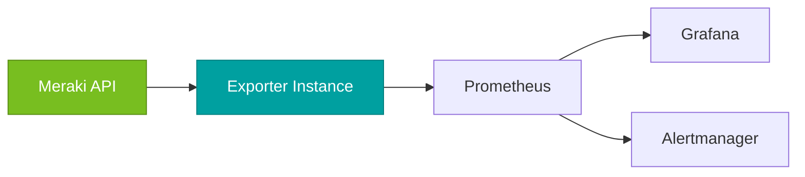
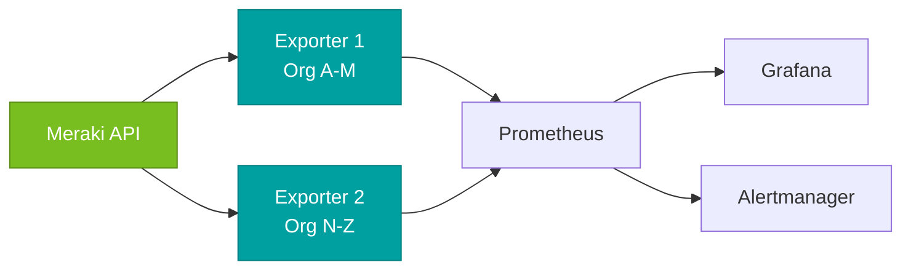
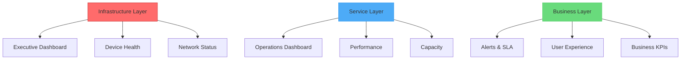

# Deployment & Operations

This guide covers production deployment strategies, monitoring best practices, performance optimization, and comprehensive troubleshooting for the Meraki Dashboard Exporter.

## Production Deployment

### Architecture Patterns

#### Single Instance Deployment

For most organizations, a single exporter instance is sufficient:



#### High Availability Deployment

For critical monitoring with large deployments:



### Docker Production Setup

#### Secure Docker Compose

```yaml
version: '3.8'

services:
  meraki-exporter:
    image: ghcr.io/rknightion/meraki-dashboard-exporter:latest
    container_name: meraki-exporter
    restart: unless-stopped
    ports:
      - "127.0.0.1:9099:9099"  # Bind to localhost only
    environment:
      - MERAKI_API_KEY_FILE=/run/secrets/meraki_api_key
      - MERAKI_EXPORTER_LOG_LEVEL=INFO
      - MERAKI_EXPORTER_LOG_FORMAT=json
    secrets:
      - meraki_api_key
    healthcheck:
      test: ["CMD", "python", "-c", "import httpx; httpx.get('http://localhost:9099/health').raise_for_status()"]
      interval: 30s
      timeout: 10s
      retries: 3
      start_period: 40s
    security_opt:
      - no-new-privileges:true
    read_only: true
    user: "1000:1000"
    tmpfs:
      - /tmp
    deploy:
      resources:
        limits:
          memory: 512M
          cpus: '0.5'
        reservations:
          memory: 256M
          cpus: '0.25'

secrets:
  meraki_api_key:
    file: ./secrets/meraki_api_key.txt

networks:
  default:
    driver: bridge
    driver_opts:
      com.docker.network.driver.mtu: 1500
```

#### Production Environment Variables

```bash
# Security
MERAKI_API_KEY_FILE=/etc/secrets/meraki_api_key
MERAKI_EXPORTER_HOST=127.0.0.1

# Performance
MERAKI_EXPORTER_API_TIMEOUT=60
MERAKI_EXPORTER_API_MAX_RETRIES=5

# Logging
MERAKI_EXPORTER_LOG_LEVEL=INFO
MERAKI_EXPORTER_LOG_FORMAT=json

# OpenTelemetry (optional)
OTEL_EXPORTER_OTLP_ENDPOINT=http://otel-collector:4317
OTEL_SERVICE_NAME=meraki-dashboard-exporter-prod
OTEL_RESOURCE_ATTRIBUTES=environment=production,datacenter=us-east-1
```

### Kubernetes Production Deployment

Complete production-ready Kubernetes manifest:

```yaml
---
apiVersion: v1
kind: Namespace
metadata:
  name: monitoring
---
apiVersion: v1
kind: Secret
metadata:
  name: meraki-api-key
  namespace: monitoring
type: Opaque
stringData:
  api-key: "your-api-key-here"
---
apiVersion: apps/v1
kind: Deployment
metadata:
  name: meraki-exporter
  namespace: monitoring
  labels:
    app: meraki-exporter
    version: v1
spec:
  replicas: 1
  strategy:
    type: RollingUpdate
    rollingUpdate:
      maxUnavailable: 0
      maxSurge: 1
  selector:
    matchLabels:
      app: meraki-exporter
  template:
    metadata:
      labels:
        app: meraki-exporter
        version: v1
      annotations:
        prometheus.io/scrape: "true"
        prometheus.io/port: "9099"
        prometheus.io/path: "/metrics"
    spec:
      serviceAccountName: meraki-exporter
      securityContext:
        runAsNonRoot: true
        runAsUser: 1000
        runAsGroup: 1000
        fsGroup: 1000
      containers:
      - name: meraki-exporter
        image: ghcr.io/rknightion/meraki-dashboard-exporter:latest
        imagePullPolicy: Always
        ports:
        - containerPort: 9099
          name: metrics
          protocol: TCP
        env:
        - name: MERAKI_API_KEY
          valueFrom:
            secretKeyRef:
              name: meraki-api-key
              key: api-key
        - name: MERAKI_EXPORTER_LOG_LEVEL
          value: "INFO"
        - name: MERAKI_EXPORTER_LOG_FORMAT
          value: "json"
        livenessProbe:
          httpGet:
            path: /health
            port: 9099
          initialDelaySeconds: 30
          periodSeconds: 30
          timeoutSeconds: 10
          failureThreshold: 3
        readinessProbe:
          httpGet:
            path: /health
            port: 9099
          initialDelaySeconds: 10
          periodSeconds: 10
          timeoutSeconds: 5
          failureThreshold: 3
        resources:
          requests:
            memory: "256Mi"
            cpu: "100m"
          limits:
            memory: "512Mi"
            cpu: "500m"
        securityContext:
          allowPrivilegeEscalation: false
          readOnlyRootFilesystem: true
          capabilities:
            drop:
            - ALL
---
apiVersion: v1
kind: ServiceAccount
metadata:
  name: meraki-exporter
  namespace: monitoring
---
apiVersion: v1
kind: Service
metadata:
  name: meraki-exporter
  namespace: monitoring
  labels:
    app: meraki-exporter
  annotations:
    prometheus.io/scrape: "true"
    prometheus.io/port: "9099"
spec:
  type: ClusterIP
  ports:
  - port: 9099
    targetPort: 9099
    protocol: TCP
    name: metrics
  selector:
    app: meraki-exporter
---
apiVersion: policy/v1
kind: PodDisruptionBudget
metadata:
  name: meraki-exporter
  namespace: monitoring
spec:
  minAvailable: 0
  selector:
    matchLabels:
      app: meraki-exporter
```

## Monitoring & Observability

### Monitoring Strategy

Use a three-layer approach to monitor your Meraki infrastructure:



### Key Metrics to Monitor

#### Infrastructure Health

```promql
# Overall device availability
avg(meraki_device_up) * 100

# Devices offline for >15 minutes
count(meraki_device_up == 0)

# Switch port utilization
histogram_quantile(0.95, 
  rate(meraki_ms_port_traffic_bytes_bucket[5m]) * 8 / 1e9
)

# Wireless client density
meraki_mr_clients_connected / 
count by (network_name) (meraki_device_up{device_model=~"MR.*"})
```

#### Network Performance

```promql
# Channel utilization trends
avg by (network_name) (meraki_ap_channel_utilization_5ghz_percent)

# Connection success rate
meraki_network_wireless_connection_stats_total{stat_type="success"} /
on(network_id) 
meraki_network_wireless_connection_stats_total{stat_type="assoc"}

# Data transfer rates
rate(meraki_org_usage_total_kb[5m]) * 1024 / 1000  # Convert to bytes/sec
```

#### Environmental Monitoring

```promql
# Temperature anomalies
abs(meraki_mt_temperature_celsius - 
    avg by (network_name) (meraki_mt_temperature_celsius)
) > 5

# Humidity out of optimal range
meraki_mt_humidity_percent < 30 or meraki_mt_humidity_percent > 70

# Door sensors (open duration)
meraki_mt_door_status == 1
```

#### Exporter Health

```promql
# Collection success rate
rate(meraki_collector_last_success_timestamp_seconds[5m]) > 0

# API error rate
rate(meraki_collector_errors_total[5m])

# Collection duration
histogram_quantile(0.95, 
  rate(meraki_collector_duration_seconds_bucket[5m])
)

# API rate limit usage
rate(meraki_collector_api_calls_total[5m])
```

### Alerting Rules

#### Critical Infrastructure Alerts

```yaml
groups:
- name: meraki.critical
  rules:
  - alert: MerakiDeviceDown
    expr: meraki_device_up == 0
    for: 5m
    labels:
      severity: critical
    annotations:
      summary: "Meraki device {{ $labels.name }} is offline"
      description: "Device {{ $labels.name }} ({{ $labels.serial }}) in network {{ $labels.network_name }} has been offline for more than 5 minutes."

  - alert: MerakiHighTemperature
    expr: meraki_mt_temperature_celsius > 35
    for: 2m
    labels:
      severity: warning
    annotations:
      summary: "High temperature detected"
      description: "Temperature sensor {{ $labels.name }} reports {{ $value }}°C, which exceeds the threshold."

  - alert: MerakiCollectorDown
    expr: up{job="meraki"} == 0
    for: 2m
    labels:
      severity: critical
    annotations:
      summary: "Meraki exporter is down"
      description: "The Meraki Dashboard Exporter has been unreachable for more than 2 minutes."
```

#### Performance Alerts

```yaml
- name: meraki.performance
  rules:
  - alert: MerakiHighChannelUtilization
    expr: meraki_ap_channel_utilization_5ghz_percent > 70
    for: 10m
    labels:
      severity: warning
    annotations:
      summary: "High channel utilization on {{ $labels.name }}"
      description: "5GHz channel utilization on AP {{ $labels.name }} has been above 70% for 10 minutes."

  - alert: MerakiAPIErrors
    expr: rate(meraki_collector_errors_total[5m]) > 0.1
    for: 5m
    labels:
      severity: warning
    annotations:
      summary: "High API error rate"
      description: "Meraki API error rate is {{ $value | humanizePercentage }} over the last 5 minutes."

  - alert: MerakiSlowCollection
    expr: histogram_quantile(0.95, rate(meraki_collector_duration_seconds_bucket[5m])) > 120
    for: 5m
    labels:
      severity: warning
    annotations:
      summary: "Slow metric collection"
      description: "95th percentile collection time is {{ $value }}s, indicating performance issues."
```

## Performance Optimization

### Resource Sizing

#### Memory Requirements

| Deployment Size | Memory Request | Memory Limit | CPU Request | CPU Limit |
|----------------|---------------|-------------|-------------|-----------|
| Small (1-5 orgs) | 128Mi | 256Mi | 50m | 200m |
| Medium (6-20 orgs) | 256Mi | 512Mi | 100m | 500m |
| Large (21-50 orgs) | 512Mi | 1Gi | 200m | 1000m |
| Enterprise (50+ orgs) | 1Gi | 2Gi | 500m | 2000m |

#### API Rate Limit Considerations

```bash
# Conservative settings (recommended for shared API keys)
MERAKI_EXPORTER_FAST_UPDATE_INTERVAL=120
MERAKI_EXPORTER_MEDIUM_UPDATE_INTERVAL=600
MERAKI_EXPORTER_SLOW_UPDATE_INTERVAL=1800

# Aggressive settings (dedicated API key with high limits)
MERAKI_EXPORTER_FAST_UPDATE_INTERVAL=60
MERAKI_EXPORTER_MEDIUM_UPDATE_INTERVAL=300
MERAKI_EXPORTER_SLOW_UPDATE_INTERVAL=900

# High-frequency monitoring (testing only)
MERAKI_EXPORTER_FAST_UPDATE_INTERVAL=30
MERAKI_EXPORTER_MEDIUM_UPDATE_INTERVAL=120
MERAKI_EXPORTER_SLOW_UPDATE_INTERVAL=300
```

### Optimization Strategies

#### API Efficiency

1. **Org-specific Monitoring**: Use `MERAKI_EXPORTER_ORG_ID` for focused monitoring
2. **Regional Endpoints**: Use regional API endpoints for better latency
3. **Timeout Tuning**: Increase timeouts for large deployments
4. **Retry Logic**: Configure appropriate retry strategies

```bash
# Optimized API settings
MERAKI_EXPORTER_API_TIMEOUT=60
MERAKI_EXPORTER_API_MAX_RETRIES=5
MERAKI_EXPORTER_API_BASE_URL=https://api.meraki.ca/api/v1  # Regional
```

#### Container Optimization

```yaml
# Optimized container settings
resources:
  requests:
    memory: "256Mi"
    cpu: "100m"
  limits:
    memory: "512Mi"
    cpu: "500m"

# JVM-like settings for Python
env:
- name: PYTHONUNBUFFERED
  value: "1"
- name: PYTHONDONTWRITEBYTECODE
  value: "1"
```

## Troubleshooting

### Diagnostic Commands

#### Quick Health Check

```bash
# Basic connectivity
curl -f http://localhost:9099/health || echo "Health check failed"

# Metric count
METRIC_COUNT=$(curl -s http://localhost:9099/metrics | grep -c "^meraki_")
echo "Collecting $METRIC_COUNT metrics"

# Last successful collection
curl -s http://localhost:9099/metrics | grep "meraki_collector_last_success" | \
  awk '{print $1, strftime("%Y-%m-%d %H:%M:%S", $2)}'
```

#### Performance Diagnostics

```bash
# Collection performance
curl -s http://localhost:9099/metrics | grep "meraki_collector_duration_seconds" | \
  grep -E "(sum|count)"

# API call rates
curl -s http://localhost:9099/metrics | grep "meraki_collector_api_calls_total"

# Error rates
curl -s http://localhost:9099/metrics | grep "meraki_collector_errors_total"
```

### Common Issues & Solutions

#### Issue: No Metrics Appearing

**Symptoms**: `/metrics` endpoint returns empty or no Meraki metrics

**Diagnostic Steps**:
```bash
# 1. Check logs for errors
docker logs meraki-exporter --tail 50 | grep -i error

# 2. Verify API key
curl -H "X-Cisco-Meraki-API-Key: $MERAKI_API_KEY" \
  https://api.meraki.com/api/v1/organizations

# 3. Check API access is enabled
# Log into Meraki Dashboard → Organization → Settings → Dashboard API access
```

**Solutions**:
1. **Invalid API Key**: Regenerate API key in Meraki Dashboard
2. **API Access Disabled**: Enable in Organization Settings
3. **Network Connectivity**: Test with `curl` or `telnet api.meraki.com 443`
4. **Wrong Regional Endpoint**: Use correct API base URL

#### Issue: API Rate Limiting (429 Errors)

**Symptoms**: 429 errors in logs, missing metrics

**Diagnostic Steps**:
```bash
# Check rate limit errors
docker logs meraki-exporter | grep "429\|rate"

# Monitor API call frequency
curl -s http://localhost:9099/metrics | grep "meraki_collector_api_calls_total" | \
  grep rate
```

**Solutions**:
1. **Increase Intervals**: Extend update intervals
2. **Reduce Scope**: Monitor fewer organizations
3. **Check API Limits**: Review limits in Meraki Dashboard
4. **Implement Backoff**: Use exponential backoff (built-in)

#### Issue: High Memory Usage

**Symptoms**: Container OOM kills, high memory consumption

**Diagnostic Steps**:
```bash
# Check container memory
docker stats meraki-exporter --no-stream

# Check metric cardinality
curl -s http://localhost:9099/metrics | wc -l
```

**Solutions**:
1. **Increase Memory Limits**: Adjust container resources
2. **Reduce Collection Scope**: Monitor fewer devices/networks
3. **Optimize Intervals**: Use longer intervals for slow-changing data

#### Issue: Slow Performance

**Symptoms**: Long collection times, timeouts

**Diagnostic Steps**:
```bash
# Check collection duration
curl -s http://localhost:9099/metrics | grep "meraki_collector_duration_seconds"

# API latency test
time curl -H "X-Cisco-Meraki-API-Key: $MERAKI_API_KEY" \
  https://api.meraki.com/api/v1/organizations
```

**Solutions**:
1. **Increase Timeouts**: Extend API timeout values
2. **Use Regional Endpoints**: Reduce API latency
3. **Optimize Resources**: Increase CPU/memory limits
4. **Check Network**: Verify connectivity and bandwidth

#### Issue: Missing Specific Metrics

**Symptoms**: Some device types or metrics not appearing

**Diagnostic Steps**:
```bash
# Check for specific device metrics
curl -s http://localhost:9099/metrics | grep "meraki_ms_"  # Switch metrics
curl -s http://localhost:9099/metrics | grep "meraki_mr_"  # AP metrics

# Check debug logs for specific collectors
docker logs meraki-exporter | grep -i "collector.*device"
```

**Solutions**:
1. **API Permissions**: Verify API key has access to all device types
2. **Device Support**: Check if device type is supported
3. **Configuration**: Ensure proper org/network access
4. **API Availability**: Some metrics require specific license levels

### Advanced Troubleshooting

#### Debug Mode

Enable comprehensive debugging:

```bash
# Enable debug logging
MERAKI_EXPORTER_LOG_LEVEL=DEBUG

# With Docker Compose
echo "MERAKI_EXPORTER_LOG_LEVEL=DEBUG" >> .env
docker-compose restart meraki-exporter

# Check detailed logs
docker logs meraki-exporter | grep -A5 -B5 "ERROR"
```

#### Network Troubleshooting

```bash
# Test API connectivity
curl -v https://api.meraki.com/api/v1/organizations \
  -H "X-Cisco-Meraki-API-Key: $MERAKI_API_KEY"

# Check regional endpoints
curl -I https://api.meraki.ca/api/v1/organizations
curl -I https://api.meraki.com/api/v1/organizations

# Test from container
docker exec meraki-exporter curl -I https://api.meraki.com/api/v1/organizations
```

#### Performance Profiling

```bash
# Enable performance metrics
curl -s http://localhost:9099/metrics | grep -E "(duration|calls|errors)"

# Monitor over time
while true; do
  echo "$(date): $(curl -s http://localhost:9099/metrics | grep -c meraki_)"
  sleep 30
done
```

## Operational Procedures

### Deployment Checklist

- [ ] API key configured securely
- [ ] Resource limits appropriate for deployment size
- [ ] Health checks configured
- [ ] Monitoring and alerting in place
- [ ] Regional API endpoint configured (if applicable)
- [ ] Log aggregation configured
- [ ] Backup/recovery procedures documented

### Maintenance Procedures

#### Routine Maintenance

1. **Monitor Resource Usage**: Check memory/CPU weekly
2. **Review API Usage**: Monitor rate limit consumption
3. **Check Alert Rules**: Validate alerting is working
4. **Update Images**: Keep container images current

#### Upgrade Procedures

1. **Review Changelog**: Check for breaking changes
2. **Test in Staging**: Validate new version
3. **Rolling Update**: Use zero-downtime deployment
4. **Verify Metrics**: Ensure all metrics still work
5. **Monitor Performance**: Watch for regression

### Security Best Practices

1. **API Key Management**: Use secrets management, rotate regularly
2. **Network Security**: Restrict access, use TLS
3. **Container Security**: Run as non-root, read-only filesystem
4. **Access Control**: Implement RBAC for Kubernetes
5. **Monitoring**: Log access and API usage

## Getting Help

### Log Analysis

Key log patterns to look for:

```bash
# Successful startup
docker logs meraki-exporter | grep "Starting Meraki Dashboard Exporter"

# API errors
docker logs meraki-exporter | grep -E "(401|403|429|500)"

# Collection errors
docker logs meraki-exporter | grep "collection.*failed"

# Performance issues
docker logs meraki-exporter | grep -E "(timeout|slow|duration)"
```

### Support Resources

- **Documentation**: Complete reference in this guide
- **GitHub Issues**: [Report problems](https://github.com/rknightion/meraki-dashboard-exporter/issues)
- **Discussions**: [Community support](https://github.com/rknightion/meraki-dashboard-exporter/discussions)
- **Monitoring Examples**: See [Integration & Dashboards](integration-dashboards.md) 