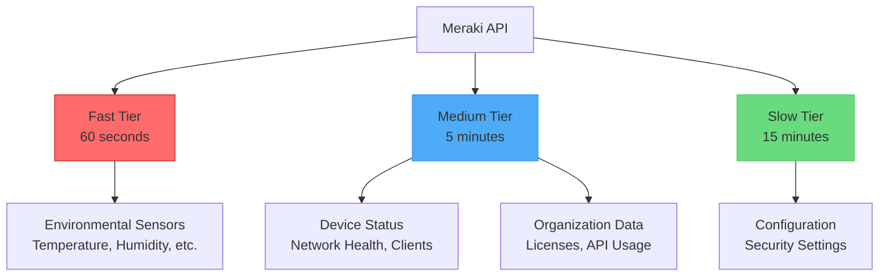

# Getting Started

Get the Meraki Dashboard Exporter up and running quickly with this comprehensive guide that covers installation, configuration, and your first metrics collection.

## Prerequisites

Before starting, ensure you have:

- [ ] Docker installed (or Python 3.11+ for development)
- [ ] A Meraki Dashboard account with API access enabled
- [ ] Your Meraki API key

!!! tip "Getting your API Key"
    1. Log in to the [Meraki Dashboard](https://dashboard.meraki.com)
    2. Navigate to **Organization > Settings**
    3. Check **Enable access to the Cisco Meraki Dashboard API**
    4. Go to **My Profile** (top right)
    5. Under **API access**, click **Generate new API key**
    6. Copy and securely store your API key

## Quick Start

### Step 1: Create Configuration

Create a `.env` file with your API key:

```bash
cat > .env << EOF
MERAKI_API_KEY=your_actual_api_key_here
MERAKI_EXPORTER_LOG_LEVEL=INFO
EOF
```

!!! warning "Security Note"
    Never commit your `.env` file to version control. Add it to `.gitignore`.

### Step 2: Run the Exporter

=== "Docker Compose (Recommended)"

    Create a `docker-compose.yml` file:

    ```yaml
    services:
      meraki-exporter:
        image: ghcr.io/rknightion/meraki-dashboard-exporter:latest
        container_name: meraki-exporter
        restart: unless-stopped
        ports:
          - "9099:9099"
        env_file:
          - .env
        healthcheck:
          test: ["CMD", "python", "-c", "import httpx; httpx.get('http://localhost:9099/health').raise_for_status()"]
          interval: 30s
          timeout: 10s
          retries: 3
    ```

    Then run:
    ```bash
    docker-compose up -d
    ```

=== "Docker CLI"

    ```bash
    docker run -d \
      --name meraki-exporter \
      --env-file .env \
      -p 9099:9099 \
      --restart unless-stopped \
      ghcr.io/rknightion/meraki-dashboard-exporter:latest
    ```

=== "Python Development"

    ```bash
    # Clone the repository
    git clone https://github.com/rknightion/meraki-dashboard-exporter.git
    cd meraki-dashboard-exporter

    # Install with uv (recommended)
    uv pip install -e .

    # Or install with pip
    pip install -e .

    # Run the exporter
    source .env && python -m meraki_dashboard_exporter
    ```

### Step 3: Verify Installation

Check that everything is working:

```bash
# Health check
curl http://localhost:9099/health
# Expected: {"status": "healthy"}

# Count metrics
curl -s http://localhost:9099/metrics | grep -c "^meraki_"
# Should show 70+ metrics

# View sample metrics
curl -s http://localhost:9099/metrics | grep "meraki_org_" | head -5
```

## Installation Methods

### Docker (Production)

The Docker image is the recommended way to run the exporter in production:

```bash
# Pull the latest image
docker pull ghcr.io/rknightion/meraki-dashboard-exporter:latest
```

The Docker image includes:
- Security hardening (non-root user, read-only filesystem)
- Health checks
- Minimal attack surface
- Multi-architecture support (amd64, arm64)

### Kubernetes

For Kubernetes deployments:

```yaml
apiVersion: apps/v1
kind: Deployment
metadata:
  name: meraki-exporter
  labels:
    app: meraki-exporter
spec:
  replicas: 1
  selector:
    matchLabels:
      app: meraki-exporter
  template:
    metadata:
      labels:
        app: meraki-exporter
    spec:
      containers:
      - name: meraki-exporter
        image: ghcr.io/rknightion/meraki-dashboard-exporter:latest
        ports:
        - containerPort: 9099
          name: metrics
        env:
        - name: MERAKI_API_KEY
          valueFrom:
            secretKeyRef:
              name: meraki-api-key
              key: api-key
        livenessProbe:
          httpGet:
            path: /health
            port: 9099
          initialDelaySeconds: 30
          periodSeconds: 30
        readinessProbe:
          httpGet:
            path: /health
            port: 9099
          initialDelaySeconds: 10
          periodSeconds: 10
        resources:
          requests:
            memory: "256Mi"
            cpu: "100m"
          limits:
            memory: "512Mi"
            cpu: "500m"
---
apiVersion: v1
kind: Service
metadata:
  name: meraki-exporter
  labels:
    app: meraki-exporter
spec:
  ports:
  - port: 9099
    targetPort: 9099
    name: metrics
  selector:
    app: meraki-exporter
```

## Configuration

The exporter is configured entirely through environment variables:

### Core Settings

| Variable | Default | Description |
|----------|---------|-------------|
| `MERAKI_API_KEY` | *Required* | Your Meraki Dashboard API key |
| `MERAKI_EXPORTER_ORG_ID` | *None* | Specific organization ID to monitor (monitors all orgs if not set) |
| `MERAKI_EXPORTER_PORT` | `9099` | Port for the metrics endpoint |
| `MERAKI_EXPORTER_HOST` | `0.0.0.0` | Host to bind the metrics server |

### API Configuration

| Variable | Default | Description |
|----------|---------|-------------|
| `MERAKI_EXPORTER_API_BASE_URL` | `https://api.meraki.com/api/v1` | API base URL for regional endpoints |
| `MERAKI_EXPORTER_API_TIMEOUT` | `30` | API request timeout in seconds |
| `MERAKI_EXPORTER_API_MAX_RETRIES` | `4` | Maximum number of API retry attempts |

#### Regional API Endpoints

For users in specific regions, configure the appropriate API base URL:

- **Global/Default**: `https://api.meraki.com/api/v1`
- **Canada**: `https://api.meraki.ca/api/v1`
- **China**: `https://api.meraki.cn/api/v1`
- **India**: `https://api.meraki.in/api/v1`
- **US Federal**: `https://api.gov-meraki.com/api/v1`

### Collection Intervals

| Variable | Default | Description |
|----------|---------|-------------|
| `MERAKI_EXPORTER_FAST_UPDATE_INTERVAL` | `60` | Fast tier interval (sensor metrics) in seconds |
| `MERAKI_EXPORTER_MEDIUM_UPDATE_INTERVAL` | `300` | Medium tier interval (devices, networks) in seconds |
| `MERAKI_EXPORTER_SLOW_UPDATE_INTERVAL` | `900` | Slow tier interval (config, licenses) in seconds |

### Logging Configuration

| Variable | Default | Description |
|----------|---------|-------------|
| `MERAKI_EXPORTER_LOG_LEVEL` | `INFO` | Logging level (DEBUG, INFO, WARNING, ERROR) |
| `MERAKI_EXPORTER_LOG_FORMAT` | `json` | Log format (json, console) |

### OpenTelemetry Configuration

| Variable | Default | Description |
|----------|---------|-------------|
| `OTEL_EXPORTER_OTLP_ENDPOINT` | *None* | OpenTelemetry collector endpoint |
| `OTEL_SERVICE_NAME` | `meraki-dashboard-exporter` | Service name for traces |
| `OTEL_RESOURCE_ATTRIBUTES` | *None* | Additional resource attributes |

## Collection Architecture

The exporter uses a three-tier collection system optimized for the Meraki API:



### Fast Tier (60 seconds)
- **Purpose**: Real-time environmental monitoring
- **Metrics**: MT sensor readings (temperature, humidity, door status, etc.)
- **Use Case**: Critical environmental alerts, real-time dashboards

### Medium Tier (5 minutes)
- **Purpose**: Standard operational metrics
- **Metrics**: Device status, network health, client counts, traffic statistics
- **Aligned**: With Meraki's 5-minute data aggregation windows

### Slow Tier (15 minutes)
- **Purpose**: Configuration and slowly changing data
- **Metrics**: Security settings, configuration changes, license status
- **Use Case**: Compliance monitoring, configuration drift detection

## Testing Your Setup

### Basic Functionality Test

```bash
# 1. Check health endpoint
curl http://localhost:9099/health

# 2. Check metrics are being collected
curl -s http://localhost:9099/metrics | grep "meraki_org_info"

# 3. Check collector status
curl -s http://localhost:9099/metrics | grep "meraki_collector_last_success"

# 4. View logs
docker logs meraki-exporter --tail 20
```

### Advanced Verification

```bash
# Check API connectivity
curl -s http://localhost:9099/metrics | grep "meraki_collector_api_calls_total"

# Check for errors
curl -s http://localhost:9099/metrics | grep "meraki_collector_errors_total"

# Monitor collection duration
curl -s http://localhost:9099/metrics | grep "meraki_collector_duration_seconds"
```

## Common Configuration Examples

### Monitor Specific Organization

```bash
# Add to your .env file
MERAKI_EXPORTER_ORG_ID=123456
```

### Faster Updates for Testing

```bash
# Add to your .env file
MERAKI_EXPORTER_FAST_UPDATE_INTERVAL=30
MERAKI_EXPORTER_MEDIUM_UPDATE_INTERVAL=120
MERAKI_EXPORTER_SLOW_UPDATE_INTERVAL=300
```

### Debug Mode

```bash
# Add to your .env file
MERAKI_EXPORTER_LOG_LEVEL=DEBUG
```

### Production Security

```bash
# Bind to localhost only
MERAKI_EXPORTER_HOST=127.0.0.1

# Use file-based API key
MERAKI_API_KEY_FILE=/etc/secrets/meraki_api_key
```

## Troubleshooting Quick Fixes

### No Metrics Appearing

1. **Check API Key**: Verify it's correct and API access is enabled
2. **Check Logs**: Look for authentication or connection errors
3. **Test API**: `curl -H "X-Cisco-Meraki-API-Key: $MERAKI_API_KEY" https://api.meraki.com/api/v1/organizations`

### API Rate Limiting (429 Errors)

1. **Increase Intervals**: Set longer update intervals
2. **Reduce Scope**: Monitor fewer organizations
3. **Check Limits**: Review your API rate limits in Meraki Dashboard

### Connection Issues

1. **Regional Endpoint**: Try the correct regional API URL
2. **Proxy Settings**: Configure if behind a corporate proxy
3. **Firewall**: Ensure outbound HTTPS access to Meraki API

### Performance Issues

1. **Resource Limits**: Increase container memory/CPU limits
2. **Concurrent Limits**: Default limits are conservative
3. **API Timeouts**: Increase `MERAKI_EXPORTER_API_TIMEOUT`

## Next Steps

Now that you have the exporter running:

1. **Explore Metrics**: Check the [Metrics Reference](metrics.md) for all available metrics
2. **Set Up Monitoring**: Follow the [Deployment & Operations](deployment-operations.md) guide
3. **Create Dashboards**: Use the [Integration & Dashboards](integration-dashboards.md) guide
4. **Configure Alerts**: Set up Prometheus alerting rules for critical metrics

## Getting Help

- **Troubleshooting**: See the [Deployment & Operations](deployment-operations.md#troubleshooting) section
- **GitHub Issues**: [Report bugs or request features](https://github.com/rknightion/meraki-dashboard-exporter/issues)
- **Discussions**: [Ask questions and share tips](https://github.com/rknightion/meraki-dashboard-exporter/discussions)
