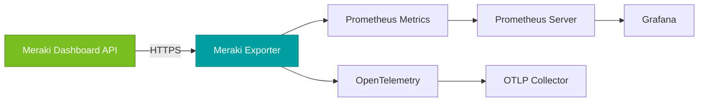

# Meraki Dashboard Exporter

<div class="hero" markdown>

**A high-performance Prometheus exporter for Cisco Meraki Dashboard API metrics with comprehensive monitoring capabilities and OpenTelemetry support**

<div class="hero-badges" markdown>
[](https://github.com/rknightion/meraki-dashboard-exporter/releases){ .md-button .md-button--primary }
[](https://github.com/rknightion/meraki-dashboard-exporter/pkgs/container/meraki-dashboard-exporter){ .md-button }
[](https://github.com/rknightion/meraki-dashboard-exporter/blob/main/LICENSE){ .md-button }
</div>

[Get Started :material-rocket-launch:](getting-started.md){ .md-button .md-button--primary .md-button--stretch }
[View on GitHub :fontawesome-brands-github:](https://github.com/rknightion/meraki-dashboard-exporter){ .md-button .md-button--stretch }

</div>

## Overview

The Meraki Dashboard Exporter is a high-performance Prometheus exporter that collects metrics from the Cisco Meraki Dashboard API. It provides comprehensive monitoring capabilities for your Meraki infrastructure, supporting all device types and organization-level metrics.

## Key Features

<div class="grid cards" markdown>

- :material-speedometer: **High Performance**

    ---

    Asynchronous collection with intelligent tiering for optimal API usage

- :material-chart-line: **Comprehensive Metrics**

    ---

    Support for all Meraki device types (MS, MR, MV, MT, MX, MG)

- :material-docker: **Container Ready**

    ---

    Production-ready Docker images with health checks

- :material-cloud-sync: **OpenTelemetry**

    ---

    Built-in support for metrics and structured logging

- :material-gauge: **Smart Collection**

    ---

    Three-tier update system matching Meraki API data freshness

- :material-shield-check: **Enterprise Ready**

    ---

    Structured logging, error handling, and performance monitoring

</div>

## Quick Start

=== "Docker"

    ```bash
    # Create configuration
    cat > .env << EOF
    MERAKI_API_KEY=your_api_key_here
    MERAKI_EXPORTER_LOG_LEVEL=INFO
    EOF

    # Run with Docker
    docker run -d \
      --name meraki-exporter \
      --env-file .env \
      -p 9099:9099 \
      ghcr.io/rknightion/meraki-dashboard-exporter:latest
    ```

=== "Docker Compose"

    ```yaml
    services:
      meraki-exporter:
        image: ghcr.io/rknightion/meraki-dashboard-exporter:latest
        ports:
          - "9099:9099"
        environment:
          - MERAKI_API_KEY=${MERAKI_API_KEY}
        restart: unless-stopped
    ```

=== "Python"

    ```bash
    # Install with uv
    uv pip install meraki-dashboard-exporter

    # Set environment
    export MERAKI_API_KEY=your_api_key_here

    # Run exporter
    python -m meraki_dashboard_exporter
    ```

## Architecture



## Metrics at a Glance

| Category | Examples | Update Frequency |
|----------|----------|------------------|
| **Organization** | API usage, licenses, device counts, client counts | 5 minutes |
| **Devices** | Status, uptime, performance | 5 minutes |
| **Sensors** | Temperature, humidity, door status, water detection | 60 seconds |
| **Alerts** | Active alerts by severity and type | 5 minutes |
| **Configuration** | Security settings, change tracking | 15 minutes |

## Next Steps

<div class="grid cards" markdown>

- :material-rocket-launch: **[Getting Started](getting-started.md)**

    ---

    Installation, configuration, and first setup

- :material-wrench: **[Deployment & Operations](deployment-operations.md)**

    ---

    Production deployment, monitoring, and troubleshooting

- :material-puzzle: **[Integration & Dashboards](integration-dashboards.md)**

    ---

    Prometheus, Grafana, and OpenTelemetry setup

- :material-book-open-variant: **[Metrics Reference](metrics/overview.md)**

    ---

    Complete documentation of all available metrics

</div>

## Support

- **Issues**: [GitHub Issues](https://github.com/rknightion/meraki-dashboard-exporter/issues)
- **Discussions**: [GitHub Discussions](https://github.com/rknightion/meraki-dashboard-exporter/discussions)
- **Security**: See [SECURITY.md](https://github.com/rknightion/meraki-dashboard-exporter/blob/main/SECURITY.md)
