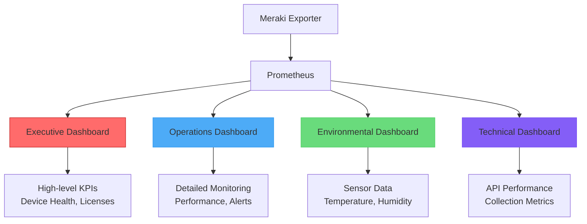

# Integration & Dashboards

This guide covers integrating the Meraki Dashboard Exporter with monitoring systems, creating effective dashboards, and setting up comprehensive observability with Prometheus, Grafana, and OpenTelemetry.

## Prometheus Integration

### Basic Configuration

Add the Meraki exporter to your `prometheus.yml`:

```yaml
global:
  scrape_interval: 15s
  evaluation_interval: 15s

scrape_configs:
  - job_name: 'meraki'
    static_configs:
      - targets: ['meraki-exporter:9099']
    scrape_interval: 30s    # Match exporter's fastest collection
    scrape_timeout: 25s     # Slightly less than interval
    metrics_path: '/metrics'

    # Optional: Add custom labels
    relabel_configs:
      - target_label: environment
        replacement: production
      - target_label: region
        replacement: us-east
```

### Service Discovery

#### Kubernetes Service Discovery

```yaml
scrape_configs:
  - job_name: 'meraki'
    kubernetes_sd_configs:
      - role: pod
        namespaces:
          names: ['monitoring']
    relabel_configs:
      - source_labels: [__meta_kubernetes_pod_label_app]
        action: keep
        regex: meraki-exporter
      - source_labels: [__meta_kubernetes_pod_name]
        target_label: pod
      - source_labels: [__meta_kubernetes_namespace]
        target_label: namespace
      - source_labels: [__meta_kubernetes_pod_annotation_prometheus_io_scrape]
        action: keep
        regex: true
```

#### Docker Swarm Service Discovery

```yaml
scrape_configs:
  - job_name: 'meraki'
    dockerswarm_sd_configs:
      - host: unix:///var/run/docker.sock
        role: services
    relabel_configs:
      - source_labels: [__meta_dockerswarm_service_name]
        regex: meraki-exporter
        action: keep
```

### Advanced Configuration

#### Metric Relabeling

Optimize metric storage and query performance:

```yaml
scrape_configs:
  - job_name: 'meraki'
    static_configs:
      - targets: ['meraki-exporter:9099']

    metric_relabel_configs:
      # Drop high-cardinality port metrics if not needed
      - source_labels: [__name__]
        regex: 'meraki_ms_port_.*'
        action: drop

      # Drop specific device serials for privacy
      - source_labels: [device_serial]
        regex: 'Q2XX-SENSITIVE.*'
        action: drop

      # Simplify device model labels
      - source_labels: [device_model]
        regex: '(M[RSXVTG])[0-9].*'
        target_label: device_type
        replacement: '${1}'

      # Add custom org label
      - source_labels: [org_name]
        regex: '(.*) - Production'
        target_label: org_group
        replacement: 'production'
```

### Recording Rules

Create efficient recording rules for common queries:

```yaml
groups:
- name: meraki.rules
  interval: 30s
  rules:
  # Device availability by organization
  - record: meraki:device_availability_by_org
    expr: |
      avg by (org_id, org_name) (meraki_device_up) * 100

  # Client density per access point
  - record: meraki:client_density_per_ap
    expr: |
      meraki_mr_clients_connected /
      count by (network_id, network_name) (meraki_device_up{device_model=~"MR.*"})

  # Network bandwidth utilization
  - record: meraki:network_bandwidth_utilization_5m
    expr: |
      rate(meraki_org_usage_total_kb[5m]) * 1024 / 1000

  # Switch port utilization by network
  - record: meraki:switch_port_utilization_by_network
    expr: |
      avg by (network_id, network_name) (
        rate(meraki_ms_port_traffic_bytes[5m]) * 8 / 1e9
      )

  # Temperature anomalies
  - record: meraki:temperature_anomaly
    expr: |
      abs(
        meraki_mt_temperature_celsius -
        avg by (network_name) (meraki_mt_temperature_celsius)
      ) > 5
```

### Alerting Rules

#### Critical Infrastructure Alerts

```yaml
groups:
- name: meraki.alerts
  rules:
  - alert: MerakiDeviceDown
    expr: meraki_device_up == 0
    for: 5m
    labels:
      severity: critical
      team: network-ops
    annotations:
      summary: "Meraki device {{ $labels.name }} is offline"
      description: |
        Device {{ $labels.name }} ({{ $labels.serial }}) in network
        {{ $labels.network_name }} has been offline for more than 5 minutes.

        Organization: {{ $labels.org_name }}
        Device Model: {{ $labels.device_model }}
      runbook_url: "https://wiki.company.com/runbooks/meraki-device-down"

  - alert: MerakiHighTemperature
    expr: meraki_mt_temperature_celsius > 35
    for: 2m
    labels:
      severity: warning
      team: facilities
    annotations:
      summary: "High temperature detected at {{ $labels.name }}"
      description: |
        Temperature sensor {{ $labels.name }} reports {{ $value }}°C,
        which exceeds the 35°C threshold.

        Location: {{ $labels.network_name }}
        Current: {{ $value }}°C

  - alert: MerakiExporterDown
    expr: up{job="meraki"} == 0
    for: 2m
    labels:
      severity: critical
      team: platform
    annotations:
      summary: "Meraki exporter is unreachable"
      description: "The Meraki Dashboard Exporter has been unreachable for more than 2 minutes."

  - alert: MerakiHighAPIErrorRate
    expr: rate(meraki_collector_errors_total[5m]) > 0.1
    for: 5m
    labels:
      severity: warning
      team: platform
    annotations:
      summary: "High Meraki API error rate"
      description: |
        Meraki API error rate is {{ $value | humanizePercentage }}
        over the last 5 minutes. This may indicate API issues or rate limiting.

  - alert: MerakiLicenseExpiring
    expr: meraki_org_licenses_expiring > 0
    for: 1h
    labels:
      severity: warning
      team: network-ops
    annotations:
      summary: "Meraki licenses expiring soon"
      description: |
        {{ $value }} {{ $labels.license_type }} licenses in organization
        {{ $labels.org_name }} are expiring within 30 days.
```

#### Performance Alerts

```yaml
- name: meraki.performance
  rules:
  - alert: MerakiHighChannelUtilization
    expr: meraki_ap_channel_utilization_5ghz_percent > 70
    for: 10m
    labels:
      severity: warning
      team: network-ops
    annotations:
      summary: "High 5GHz channel utilization on {{ $labels.name }}"
      description: |
        5GHz channel utilization on AP {{ $labels.name }} has been
        above 70% for 10 minutes. Current: {{ $value }}%

  - alert: MerakiLowConnectionSuccessRate
    expr: |
      (
        meraki_network_wireless_connection_stats_total{stat_type="success"} /
        on(network_id) meraki_network_wireless_connection_stats_total{stat_type="assoc"}
      ) * 100 < 90
    for: 15m
    labels:
      severity: warning
      team: network-ops
    annotations:
      summary: "Low wireless connection success rate in {{ $labels.network_name }}"
      description: |
        Wireless connection success rate in network {{ $labels.network_name }}
        is {{ $value }}%, below the 90% threshold.

  - alert: MerakiSlowMetricCollection
    expr: |
      histogram_quantile(0.95,
        rate(meraki_collector_duration_seconds_bucket[5m])
      ) > 120
    for: 5m
    labels:
      severity: warning
      team: platform
    annotations:
      summary: "Slow Meraki metric collection"
      description: |
        95th percentile collection time is {{ $value }}s, indicating
        performance issues with the exporter or Meraki API.
```

## Grafana Integration

### Data Source Configuration

1. **Navigate to Configuration** → **Data Sources**
2. **Click "Add data source"**
3. **Select "Prometheus"**
4. **Configure**:
   ```yaml
   Name: Prometheus-Meraki
   URL: http://prometheus:9090
   Access: Server (default)
   Scrape interval: 30s
   Query timeout: 60s
   HTTP Method: POST  # For large queries
   ```

### Dashboard Architecture

We provide several pre-built dashboards optimized for different audiences:



### Executive Dashboard

High-level overview for leadership:

```json
{
  "dashboard": {
    "id": null,
    "title": "Meraki Executive Overview",
    "tags": ["meraki", "executive"],
    "timezone": "browser",
    "refresh": "5m",
    "panels": [
      {
        "id": 1,
        "title": "Infrastructure Health Score",
        "type": "stat",
        "gridPos": {"h": 4, "w": 6, "x": 0, "y": 0},
        "targets": [{
          "expr": "avg(meraki_device_up) * 100",
          "legendFormat": "Health Score"
        }],
        "fieldConfig": {
          "defaults": {
            "unit": "percent",
            "min": 0,
            "max": 100,
            "thresholds": {
              "mode": "absolute",
              "steps": [
                {"value": 0, "color": "red"},
                {"value": 90, "color": "yellow"},
                {"value": 95, "color": "green"}
              ]
            }
          }
        }
      },
      {
        "id": 2,
        "title": "Total Active Clients",
        "type": "stat",
        "gridPos": {"h": 4, "w": 6, "x": 6, "y": 0},
        "targets": [{
          "expr": "sum(meraki_org_clients_total)",
          "legendFormat": "Active Clients"
        }],
        "fieldConfig": {
          "defaults": {
            "unit": "short",
            "color": {"mode": "value", "fixedColor": "blue"}
          }
        }
      },
      {
        "id": 3,
        "title": "Network Bandwidth Usage",
        "type": "timeseries",
        "gridPos": {"h": 8, "w": 12, "x": 0, "y": 4},
        "targets": [{
          "expr": "sum(rate(meraki_org_usage_total_kb[5m])) * 1024 / 1000 / 1000",
          "legendFormat": "Total Bandwidth (Mbps)"
        }],
        "fieldConfig": {
          "defaults": {
            "unit": "Mbps",
            "custom": {
              "drawStyle": "line",
              "lineInterpolation": "smooth"
            }
          }
        }
      },
      {
        "id": 4,
        "title": "Device Status by Type",
        "type": "piechart",
        "gridPos": {"h": 8, "w": 6, "x": 12, "y": 4},
        "targets": [{
          "expr": "sum by (device_model) (meraki_device_up)",
          "legendFormat": "{{ device_model }}"
        }]
      },
      {
        "id": 5,
        "title": "Active Alerts by Severity",
        "type": "bargauge",
        "gridPos": {"h": 6, "w": 12, "x": 0, "y": 12},
        "targets": [{
          "expr": "sum by (severity) (meraki_alerts_total_by_severity)",
          "legendFormat": "{{ severity }}"
        }],
        "fieldConfig": {
          "defaults": {
            "color": {
              "mode": "palette-classic"
            }
          },
          "overrides": [
            {"matcher": {"id": "byName", "options": "critical"}, "properties": [{"id": "color", "value": {"mode": "fixed", "fixedColor": "red"}}]},
            {"matcher": {"id": "byName", "options": "warning"}, "properties": [{"id": "color", "value": {"mode": "fixed", "fixedColor": "yellow"}}]}
          ]
        }
      },
      {
        "id": 6,
        "title": "License Utilization",
        "type": "timeseries",
        "gridPos": {"h": 6, "w": 6, "x": 12, "y": 12},
        "targets": [{
          "expr": "sum by (license_type) (meraki_org_licenses_total{status=\"active\"})",
          "legendFormat": "{{ license_type }}"
        }]
      }
    ],
    "time": {"from": "now-24h", "to": "now"},
    "timepicker": {},
    "templating": {
      "list": [
        {
          "name": "org",
          "type": "query",
          "query": "label_values(meraki_org_info, org_name)",
          "refresh": 1,
          "includeAll": true,
          "multi": true
        }
      ]
    }
  }
}
```

### Operations Dashboard

Detailed monitoring for network operations teams:

```json
{
  "dashboard": {
    "title": "Meraki Operations Dashboard",
    "tags": ["meraki", "operations"],
    "panels": [
      {
        "id": 10,
        "title": "Device Status Overview",
        "type": "table",
        "gridPos": {"h": 8, "w": 24, "x": 0, "y": 0},
        "targets": [{
          "expr": "meraki_device_up",
          "format": "table",
          "instant": true
        }],
        "transformations": [
          {
            "id": "organize",
            "options": {
              "excludeByName": {"Time": true, "__name__": true},
              "renameByName": {
                "Value": "Status",
                "name": "Device Name",
                "serial": "Serial",
                "model": "Model",
                "network_name": "Network"
              }
            }
          }
        ],
        "fieldConfig": {
          "overrides": [
            {
              "matcher": {"id": "byName", "options": "Status"},
              "properties": [
                {
                  "id": "custom.cellOptions",
                  "value": {
                    "type": "color-background",
                    "mode": "basic"
                  }
                },
                {
                  "id": "mappings",
                  "value": [
                    {"options": {"0": {"text": "Offline", "color": "red"}}, "type": "value"},
                    {"options": {"1": {"text": "Online", "color": "green"}}, "type": "value"}
                  ]
                }
              ]
            }
          ]
        }
      },
      {
        "id": 11,
        "title": "Wireless Client Connections",
        "type": "timeseries",
        "gridPos": {"h": 8, "w": 12, "x": 0, "y": 8},
        "targets": [
          {
            "expr": "sum by (network_name) (meraki_mr_clients_connected)",
            "legendFormat": "{{ network_name }}"
          }
        ]
      },
      {
        "id": 12,
        "title": "Channel Utilization by Network",
        "type": "heatmap",
        "gridPos": {"h": 8, "w": 12, "x": 12, "y": 8},
        "targets": [{
          "expr": "avg by (network_name) (meraki_ap_channel_utilization_5ghz_percent)",
          "legendFormat": "{{ network_name }}"
        }]
      },
      {
        "id": 13,
        "title": "Top Switch Ports by Traffic",
        "type": "table",
        "gridPos": {"h": 8, "w": 12, "x": 0, "y": 16},
        "targets": [{
          "expr": "topk(20, rate(meraki_ms_port_traffic_bytes[5m]) * 8 / 1e6)",
          "format": "table",
          "instant": true
        }],
        "transformations": [
          {
            "id": "organize",
            "options": {
              "renameByName": {
                "Value": "Traffic (Mbps)",
                "name": "Device",
                "port_id": "Port"
              }
            }
          }
        ]
      },
      {
        "id": 14,
        "title": "Environmental Sensors",
        "type": "timeseries",
        "gridPos": {"h": 8, "w": 12, "x": 12, "y": 16},
        "targets": [
          {
            "expr": "meraki_mt_temperature_celsius",
            "legendFormat": "{{ name }} - Temperature"
          },
          {
            "expr": "meraki_mt_humidity_percent",
            "legendFormat": "{{ name }} - Humidity"
          }
        ],
        "fieldConfig": {
          "defaults": {
            "custom": {
              "axisLabel": "Temperature (°C) / Humidity (%)"
            }
          }
        }
      }
    ],
    "templating": {
      "list": [
        {
          "name": "org",
          "type": "query",
          "query": "label_values(meraki_org_info, org_name)",
          "refresh": 1
        },
        {
          "name": "network",
          "type": "query",
          "query": "label_values(meraki_device_up{org_name=\"$org\"}, network_name)",
          "refresh": 1,
          "includeAll": true
        }
      ]
    }
  }
}
```

### Environmental Monitoring Dashboard

Specialized dashboard for MT sensor monitoring:

```json
{
  "dashboard": {
    "title": "Meraki Environmental Monitoring",
    "tags": ["meraki", "environmental", "sensors"],
    "panels": [
      {
        "id": 20,
        "title": "Temperature Heatmap",
        "type": "heatmap",
        "gridPos": {"h": 8, "w": 24, "x": 0, "y": 0},
        "targets": [{
          "expr": "meraki_mt_temperature_celsius",
          "legendFormat": "{{ network_name }} - {{ name }}"
        }],
        "fieldConfig": {
          "defaults": {
            "custom": {
              "hideFrom": {"legend": false, "tooltip": false, "vis": false}
            }
          }
        }
      },
      {
        "id": 21,
        "title": "Humidity Levels",
        "type": "timeseries",
        "gridPos": {"h": 8, "w": 12, "x": 0, "y": 8},
        "targets": [{
          "expr": "meraki_mt_humidity_percent",
          "legendFormat": "{{ name }}"
        }],
        "fieldConfig": {
          "defaults": {
            "unit": "percent",
            "min": 0,
            "max": 100,
            "thresholds": {
              "steps": [
                {"value": 0, "color": "blue"},
                {"value": 30, "color": "green"},
                {"value": 70, "color": "yellow"},
                {"value": 80, "color": "red"}
              ]
            }
          }
        }
      },
      {
        "id": 22,
        "title": "Door Status",
        "type": "stat",
        "gridPos": {"h": 4, "w": 6, "x": 12, "y": 8},
        "targets": [{
          "expr": "meraki_mt_door_status",
          "legendFormat": "{{ name }}"
        }],
        "fieldConfig": {
          "defaults": {
            "mappings": [
              {"options": {"0": {"text": "Closed", "color": "green"}}, "type": "value"},
              {"options": {"1": {"text": "Open", "color": "red"}}, "type": "value"}
            ]
          }
        }
      },
      {
        "id": 23,
        "title": "Water Detection",
        "type": "stat",
        "gridPos": {"h": 4, "w": 6, "x": 18, "y": 8},
        "targets": [{
          "expr": "meraki_mt_water_detected",
          "legendFormat": "{{ name }}"
        }],
        "fieldConfig": {
          "defaults": {
            "mappings": [
              {"options": {"0": {"text": "Dry", "color": "green"}}, "type": "value"},
              {"options": {"1": {"text": "Water Detected", "color": "red"}}, "type": "value"}
            ]
          }
        }
      }
    ]
  }
}
```

### PromQL Query Examples

#### Common Queries for Dashboards

```promql
# Device availability percentage
avg(meraki_device_up) * 100

# Devices offline by organization
count by (org_name) (meraki_device_up == 0)

# Top networks by client count
topk(10, sum by (network_name) (meraki_mr_clients_connected))

# Bandwidth usage rate (bytes/sec)
rate(meraki_org_usage_total_kb[5m]) * 1024

# Switch port utilization (percentage)
(rate(meraki_ms_port_traffic_bytes[5m]) * 8) /
(meraki_ms_port_speed_mbps * 1e6) * 100

# Temperature anomalies
abs(meraki_mt_temperature_celsius -
    avg by (network_name) (meraki_mt_temperature_celsius)) > 5

# Wireless connection success rate
(meraki_network_wireless_connection_stats_total{stat_type="success"} /
 meraki_network_wireless_connection_stats_total{stat_type="assoc"}) * 100

# API call rate per collector
rate(meraki_collector_api_calls_total[5m])

# License expiration timeline
(meraki_org_licenses_total{status="active"} -
 meraki_org_licenses_expiring) / meraki_org_licenses_total{status="active"} * 100
```

## OpenTelemetry Integration

### Configuration

The exporter natively supports OpenTelemetry for distributed tracing and structured logging:

```bash
# Basic OpenTelemetry configuration
OTEL_EXPORTER_OTLP_ENDPOINT=http://otel-collector:4317
OTEL_SERVICE_NAME=meraki-dashboard-exporter
OTEL_RESOURCE_ATTRIBUTES=environment=production,version=1.0.0

# Optional: Configure specific exporters
OTEL_EXPORTER_OTLP_TRACES_ENDPOINT=http://jaeger:14268/api/traces
OTEL_EXPORTER_OTLP_METRICS_ENDPOINT=http://prometheus:9090/api/v1/otlp/v1/metrics
OTEL_EXPORTER_OTLP_LOGS_ENDPOINT=http://loki:3100/loki/api/v1/push
```

### OpenTelemetry Collector Configuration

```yaml
receivers:
  otlp:
    protocols:
      grpc:
        endpoint: 0.0.0.0:4317
      http:
        endpoint: 0.0.0.0:4318

processors:
  batch:
  memory_limiter:
    limit_mib: 256

exporters:
  prometheus:
    endpoint: "0.0.0.0:8889"
    namespace: meraki
    const_labels:
      environment: production

  jaeger:
    endpoint: jaeger:14250
    tls:
      insecure: true

  loki:
    endpoint: http://loki:3100/loki/api/v1/push
    tenant_id: meraki

service:
  pipelines:
    traces:
      receivers: [otlp]
      processors: [memory_limiter, batch]
      exporters: [jaeger]

    metrics:
      receivers: [otlp]
      processors: [memory_limiter, batch]
      exporters: [prometheus]

    logs:
      receivers: [otlp]
      processors: [memory_limiter, batch]
      exporters: [loki]
```

### Distributed Tracing

The exporter automatically creates traces for API calls and collection cycles:

```json
{
  "traceId": "4bf92f3577b34da6a3ce929d0e0e4736",
  "spanId": "00f067aa0ba902b7",
  "operationName": "collect_organization_metrics",
  "startTime": "2024-01-15T10:00:00Z",
  "duration": "2.5s",
  "tags": {
    "service.name": "meraki-dashboard-exporter",
    "component": "OrganizationCollector",
    "org_id": "123456",
    "org_name": "Acme Corp",
    "api.method": "getOrganizations",
    "api.calls": 5
  }
}
```

### Structured Logging

All logs are structured and include trace correlation:

```json
{
  "timestamp": "2024-01-15T10:00:00Z",
  "level": "INFO",
  "message": "Collection completed successfully",
  "logger": "DeviceCollector",
  "trace_id": "4bf92f3577b34da6a3ce929d0e0e4736",
  "span_id": "00f067aa0ba902b7",
  "org_id": "123456",
  "devices_collected": 45,
  "duration_seconds": 1.8,
  "api_calls": 3
}
```

## Complete Monitoring Stack

### Docker Compose Example

Complete monitoring stack with Prometheus, Grafana, and OpenTelemetry:

```yaml
version: '3.8'

services:
  meraki-exporter:
    image: ghcr.io/rknightion/meraki-dashboard-exporter:latest
    environment:
      - MERAKI_API_KEY=${MERAKI_API_KEY}
      - OTEL_EXPORTER_OTLP_ENDPOINT=http://otel-collector:4317
      - OTEL_SERVICE_NAME=meraki-dashboard-exporter
    depends_on:
      - otel-collector
    restart: unless-stopped

  prometheus:
    image: prom/prometheus:latest
    ports:
      - "9090:9090"
    volumes:
      - ./prometheus.yml:/etc/prometheus/prometheus.yml
      - ./alerts.yml:/etc/prometheus/alerts.yml
    command:
      - '--config.file=/etc/prometheus/prometheus.yml'
      - '--storage.tsdb.path=/prometheus'
      - '--web.console.libraries=/etc/prometheus/console_libraries'
      - '--web.console.templates=/etc/prometheus/consoles'
      - '--web.enable-lifecycle'

  grafana:
    image: grafana/grafana:latest
    ports:
      - "3000:3000"
    environment:
      - GF_SECURITY_ADMIN_PASSWORD=admin
    volumes:
      - grafana-storage:/var/lib/grafana
      - ./grafana/dashboards:/etc/grafana/provisioning/dashboards
      - ./grafana/datasources:/etc/grafana/provisioning/datasources

  otel-collector:
    image: otel/opentelemetry-collector-contrib:latest
    command: ["--config=/etc/otelcol-contrib/otel-collector.yml"]
    volumes:
      - ./otel-collector.yml:/etc/otelcol-contrib/otel-collector.yml
    ports:
      - "4317:4317"   # OTLP gRPC receiver
      - "4318:4318"   # OTLP HTTP receiver
      - "8889:8889"   # Prometheus metrics

  jaeger:
    image: jaegertracing/all-in-one:latest
    ports:
      - "16686:16686"
      - "14250:14250"

  loki:
    image: grafana/loki:latest
    ports:
      - "3100:3100"
    command: -config.file=/etc/loki/local-config.yaml

volumes:
  grafana-storage:
```

## Best Practices

### Dashboard Design

1. **Audience-Specific Dashboards**: Create different views for different teams
2. **Consistent Color Schemes**: Use organization colors and standards
3. **Meaningful Thresholds**: Set thresholds based on SLAs and business requirements
4. **Template Variables**: Use variables for organization, network, and device filtering
5. **Performance Optimization**: Use recording rules for complex queries

### Query Optimization

1. **Use Recording Rules**: Pre-compute expensive queries
2. **Appropriate Time Ranges**: Match query ranges to data freshness
3. **Label Filtering**: Filter early in queries to reduce cardinality
4. **Avoid High-Cardinality Labels**: Don't use device serials unless necessary

### Alerting Strategy

1. **Layered Alerting**: Different severities for different issues
2. **Meaningful Thresholds**: Avoid alert fatigue with appropriate thresholds
3. **Context in Alerts**: Include relevant information for troubleshooting
4. **Runbook Links**: Link to procedures for resolving issues

### Performance Monitoring

Monitor the exporter itself:

```promql
# Collection success rate
rate(meraki_collector_last_success_timestamp_seconds[5m]) > 0

# API error rate by collector
rate(meraki_collector_errors_total[5m]) by (collector)

# Collection duration percentiles
histogram_quantile(0.95, rate(meraki_collector_duration_seconds_bucket[5m]))

# Memory usage of exporter
process_resident_memory_bytes{job="meraki"}
```

## Troubleshooting Integration Issues

### Common Problems

1. **Missing Metrics in Prometheus**: Check scrape configuration and targets
2. **Dashboard Not Loading**: Verify data source configuration and permissions
3. **Slow Queries**: Use recording rules and optimize PromQL queries
4. **Missing Traces**: Check OpenTelemetry configuration and endpoints

### Debug Commands

```bash
# Check Prometheus targets
curl http://prometheus:9090/api/v1/targets

# Test PromQL query
curl 'http://prometheus:9090/api/v1/query?query=up{job="meraki"}'

# Check Grafana data source
curl -u admin:admin http://grafana:3000/api/datasources

# Verify OpenTelemetry traces
curl http://jaeger:16686/api/traces?service=meraki-dashboard-exporter
```

## Getting Help

- **Dashboard JSON Files**: Available in the [GitHub repository](https://github.com/rknightion/meraki-dashboard-exporter/tree/main/dashboards)
- **PromQL Examples**: More query examples in the repository documentation
- **Community Dashboards**: Share and discover dashboards in [GitHub Discussions](https://github.com/rknightion/meraki-dashboard-exporter/discussions)
- **Integration Issues**: Report problems in [GitHub Issues](https://github.com/rknightion/meraki-dashboard-exporter/issues)
