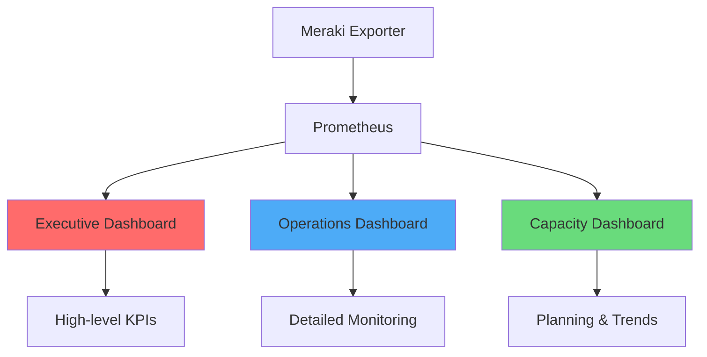

# Grafana Integration

This guide covers how to create effective Grafana dashboards for visualizing Meraki metrics collected by the exporter.

## Dashboard Overview

We provide several pre-built dashboards optimized for different use cases:



## Setting Up Grafana

### Add Prometheus Data Source

1. Navigate to **Configuration** → **Data Sources**
2. Click **Add data source**
3. Select **Prometheus**
4. Configure:
   ```yaml
   Name: Prometheus-Meraki
   URL: http://prometheus:9090
   Access: Server (default)
   Scrape interval: 30s
   Query timeout: 60s
   HTTP Method: POST  # For large queries
   ```

### Import Dashboards

Pre-built dashboards are available in the repository:

1. Go to **Dashboards** → **Import**
2. Upload JSON or paste dashboard ID
3. Select your Prometheus data source
4. Click **Import**

## Dashboard Examples

### Executive Dashboard

Key metrics for leadership visibility:

```json
{
  "dashboard": {
    "title": "Meraki Executive Overview",
    "panels": [
      {
        "title": "Infrastructure Health Score",
        "type": "stat",
        "gridPos": {"h": 4, "w": 6, "x": 0, "y": 0},
        "targets": [{
          "expr": "avg(meraki_device_up) * 100",
          "legendFormat": "Health Score"
        }],
        "fieldConfig": {
          "defaults": {
            "unit": "percent",
            "thresholds": {
              "mode": "absolute",
              "steps": [
                {"value": 0, "color": "red"},
                {"value": 90, "color": "yellow"},
                {"value": 95, "color": "green"}
              ]
            }
          }
        }
      },
      {
        "title": "Total Active Clients",
        "type": "stat",
        "gridPos": {"h": 4, "w": 6, "x": 6, "y": 0},
        "targets": [{
          "expr": "sum(meraki_org_clients_total)",
          "legendFormat": "Clients"
        }],
        "fieldConfig": {
          "defaults": {
            "unit": "short",
            "mappings": [],
            "color": {"mode": "thresholds"}
          }
        }
      },
      {
        "title": "Active Alerts",
        "type": "stat",
        "gridPos": {"h": 4, "w": 6, "x": 12, "y": 0},
        "targets": [{
          "expr": "sum(meraki_alerts_active{severity=\"critical\"})",
          "legendFormat": "Critical"
        }],
        "fieldConfig": {
          "defaults": {
            "unit": "short",
            "color": {"mode": "thresholds"},
            "thresholds": {
              "mode": "absolute",
              "steps": [
                {"value": 0, "color": "green"},
                {"value": 1, "color": "red"}
              ]
            }
          }
        }
      },
      {
        "title": "License Expiring Soon",
        "type": "stat",
        "gridPos": {"h": 4, "w": 6, "x": 18, "y": 0},
        "targets": [{
          "expr": "sum(meraki_org_licenses_expiring)",
          "legendFormat": "Expiring"
        }],
        "fieldConfig": {
          "defaults": {
            "unit": "short",
            "color": {"mode": "thresholds"},
            "thresholds": {
              "mode": "absolute",
              "steps": [
                {"value": 0, "color": "green"},
                {"value": 1, "color": "yellow"},
                {"value": 10, "color": "red"}
              ]
            }
          }
        }
      }
    ]
  }
}
```

### Network Operations Dashboard

Detailed operational view:

```json
{
  "panels": [
    {
      "title": "Device Status by Type",
      "type": "bargauge",
      "targets": [{
        "expr": "sum by (device_model) (meraki_device_up)",
        "legendFormat": "{{ device_model }}"
      }],
      "options": {
        "orientation": "horizontal",
        "displayMode": "gradient",
        "showUnfilled": true
      }
    },
    {
      "title": "Wireless Client Distribution",
      "type": "piechart",
      "targets": [{
        "expr": "topk(10, meraki_mr_clients_connected)",
        "legendFormat": "{{ device_name }}"
      }],
      "options": {
        "pieType": "donut",
        "displayLabels": ["name", "percent"],
        "legendDisplayMode": "table",
        "legendPlacement": "right"
      }
    },
    {
      "title": "Switch Port Utilization Heatmap",
      "type": "heatmap",
      "targets": [{
        "expr": "sum by (device_name, port_id) (rate(meraki_ms_port_traffic_bytes[5m]) * 8 / 1e9)",
        "format": "heatmap"
      }],
      "fieldConfig": {
        "defaults": {
          "custom": {
            "scaleDistribution": {"type": "linear"},
            "colorScheme": "interpolateSpectral"
          }
        }
      }
    },
    {
      "title": "Channel Utilization Timeline",
      "type": "timeseries",
      "targets": [
        {
          "expr": "avg by (network_name) (meraki_ap_channel_utilization_2_4ghz_percent)",
          "legendFormat": "{{ network_name }} - 2.4GHz"
        },
        {
          "expr": "avg by (network_name) (meraki_ap_channel_utilization_5ghz_percent)",
          "legendFormat": "{{ network_name }} - 5GHz"
        }
      ],
      "fieldConfig": {
        "defaults": {
          "unit": "percent",
          "max": 100,
          "thresholds": {
            "mode": "absolute",
            "steps": [
              {"value": 0, "color": "green"},
              {"value": 70, "color": "yellow"},
              {"value": 85, "color": "red"}
            ]
          }
        }
      }
    }
  ]
}
```

### Environmental Monitoring Dashboard

For sensor data visualization:

```json
{
  "panels": [
    {
      "title": "Temperature Map",
      "type": "geomap",
      "targets": [{
        "expr": "meraki_mt_temperature_celsius",
        "legendFormat": "{{ device_name }}"
      }],
      "options": {
        "view": {"id": "coords", "lat": 40.7128, "lon": -74.0060, "zoom": 10},
        "controls": {"showZoom": true, "showScale": true},
        "basemap": {"type": "osm-standard"}
      }
    },
    {
      "title": "Environmental Conditions",
      "type": "state-timeline",
      "targets": [
        {
          "expr": "meraki_mt_door_status",
          "legendFormat": "{{ device_name }} - Door"
        },
        {
          "expr": "meraki_mt_water_detected",
          "legendFormat": "{{ device_name }} - Water"
        }
      ],
      "fieldConfig": {
        "defaults": {
          "custom": {
            "fillOpacity": 70,
            "lineWidth": 0
          },
          "mappings": [
            {"type": "value", "value": 0, "text": "Normal", "color": "green"},
            {"type": "value", "value": 1, "text": "Alert", "color": "red"}
          ]
        }
      }
    },
    {
      "title": "Air Quality Metrics",
      "type": "timeseries",
      "targets": [
        {
          "expr": "meraki_mt_tvoc_ppb",
          "legendFormat": "{{ device_name }} - TVOC"
        },
        {
          "expr": "meraki_mt_pm25_micrograms_per_m3",
          "legendFormat": "{{ device_name }} - PM2.5"
        }
      ],
      "fieldConfig": {
        "defaults": {
          "custom": {
            "drawStyle": "line",
            "lineInterpolation": "smooth",
            "spanNulls": true
          }
        }
      }
    }
  ]
}
```

## Dashboard Variables

Create interactive dashboards with variables:

```json
{
  "templating": {
    "list": [
      {
        "name": "org",
        "type": "query",
        "query": "label_values(meraki_org_info, org_name)",
        "refresh": 1,
        "sort": 1
      },
      {
        "name": "network",
        "type": "query",
        "query": "label_values(meraki_device_up{org_name=\"$org\"}, network_name)",
        "refresh": 1,
        "sort": 1,
        "multi": true,
        "includeAll": true
      },
      {
        "name": "device_type",
        "type": "query",
        "query": "label_values(meraki_device_up, device_model)",
        "refresh": 1,
        "regex": "/^(M[RSXVTG]).*/",
        "sort": 1
      },
      {
        "name": "interval",
        "type": "interval",
        "query": "5m,10m,30m,1h,6h,12h,1d",
        "current": {
          "text": "5m",
          "value": "5m"
        }
      }
    ]
  }
}
```

## Advanced Visualizations

### Custom Panels

#### Network Topology View
```javascript
// Custom panel plugin for network visualization
const topology = {
  nodes: metrics.map(m => ({
    id: m.device_serial,
    label: m.device_name,
    group: m.device_model,
    value: m.meraki_device_up
  })),
  edges: connections.map(c => ({
    from: c.source,
    to: c.target,
    value: c.traffic_rate
  }))
};
```

#### Alert Heat Calendar
```json
{
  "type": "heatmap",
  "targets": [{
    "expr": "sum by (dayofweek(), hour()) (increase(meraki_alerts_active[1h]))",
    "format": "heatmap"
  }],
  "options": {
    "calculate": true,
    "calculation": {"xBuckets": {"mode": "size", "value": "1h"}},
    "color": {"mode": "scheme", "scheme": "Oranges"},
    "exemplars": {"color": "rgba(255,0,255,0.7)"},
    "tooltip": {"show": true, "showHistogram": true}
  }
}
```

### Annotations

Add context to your dashboards:

```json
{
  "annotations": {
    "list": [
      {
        "name": "Configuration Changes",
        "datasource": "Prometheus-Meraki",
        "enable": true,
        "expr": "changes(meraki_org_configuration_changes_total[5m]) > 0",
        "tagKeys": "org_name",
        "titleFormat": "Config Change",
        "textFormat": "Configuration changed in {{org_name}}"
      },
      {
        "name": "Critical Alerts",
        "datasource": "Prometheus-Meraki",
        "enable": true,
        "expr": "meraki_alerts_active{severity=\"critical\"} > 0",
        "tagKeys": "network_name,type",
        "titleFormat": "Critical Alert",
        "textFormat": "{{type}} alert in {{network_name}}"
      }
    ]
  }
}
```

## Performance Optimization

### Query Optimization

1. **Use Recording Rules**:
   ```promql
   # Instead of complex queries in dashboards
   avg by (network_name) (
     rate(meraki_ms_port_traffic_bytes[5m]) * 8 / 1e9
   )

   # Use pre-computed recording rule
   meraki:network_traffic_gbps:5m
   ```

2. **Limit Time Ranges**:
   ```json
   {
     "time": {
       "from": "now-6h",
       "to": "now"
     },
     "timepicker": {
       "time_options": ["5m", "15m", "1h", "6h", "12h", "24h"]
     }
   }
   ```

3. **Use Variable Filters**:
   ```promql
   # Filter early in the query
   meraki_device_up{org_name="$org", network_name=~"$network"}

   # Not after aggregation
   sum by (network_name) (meraki_device_up) {network_name=~"$network"}
   ```

### Dashboard Best Practices

1. **Organize by Use Case**:
   - Executive Overview (KPIs)
   - Operations (Real-time monitoring)
   - Capacity Planning (Trends)
   - Troubleshooting (Detailed metrics)

2. **Consistent Layout**:
   - Status indicators at top
   - Time series in middle
   - Tables/lists at bottom

3. **Color Consistency**:
   ```json
   {
     "fieldConfig": {
       "defaults": {
         "thresholds": {
           "steps": [
             {"value": 0, "color": "red"},      // Bad
             {"value": 80, "color": "yellow"},  // Warning
             {"value": 95, "color": "green"}    // Good
           ]
         }
       }
     }
   }
   ```

4. **Responsive Design**:
   - Use relative sizing
   - Test on different screen sizes
   - Provide mobile-friendly versions

## Alerting from Grafana

### Unified Alerting

Configure Grafana 8+ unified alerting:

```yaml
# Alert rule example
apiVersion: 1
groups:
  - name: meraki_alerts
    interval: 1m
    rules:
      - uid: device_down
        title: Meraki Device Down
        condition: device_offline
        data:
          - refId: A
            queryModel:
              expr: meraki_device_up == 0
              refId: A
        noDataState: NoData
        execErrState: Alerting
        for: 5m
        annotations:
          summary: Device {{ $labels.device_name }} is offline
          runbook_url: https://wiki.example.com/device-down
        labels:
          severity: critical
          team: network-ops
```

### Notification Channels

Configure notification channels:

```json
{
  "notifiers": [
    {
      "name": "slack-network-ops",
      "type": "slack",
      "settings": {
        "url": "https://hooks.slack.com/services/YOUR/WEBHOOK/URL",
        "channel": "#network-alerts",
        "username": "Grafana"
      }
    },
    {
      "name": "pagerduty-critical",
      "type": "pagerduty",
      "settings": {
        "integrationKey": "YOUR_INTEGRATION_KEY",
        "severity": "critical",
        "autoResolve": true
      }
    }
  ]
}
```

## Sharing and Export

### Dashboard Sharing

1. **Public Dashboards**:
   ```json
   {
     "dashboard": {
       "editable": false,
       "hideControls": true,
       "publicDashboard": {
         "enabled": true,
         "timeRange": {"from": "now-1h", "to": "now"}
       }
     }
   }
   ```

2. **Snapshots**:
   - Create point-in-time snapshots
   - Share without exposing data source
   - Set expiration for security

3. **PDF Reports**:
   ```bash
   # Using Grafana Image Renderer
   curl -X POST http://grafana:3000/render/d/meraki-overview/dashboard \
     -H "Authorization: Bearer $GRAFANA_TOKEN" \
     -d '{"width": 1920, "height": 1080, "deviceScaleFactor": 2}'
   ```

## Troubleshooting Dashboards

### Common Issues

1. **No Data**:
   - Check data source configuration
   - Verify Prometheus is scraping
   - Check time range selection

2. **Slow Queries**:
   - Use recording rules
   - Limit time ranges
   - Optimize PromQL queries

3. **Missing Variables**:
   - Check variable queries
   - Verify label existence
   - Check regex filters

### Debug Mode

Enable query inspector:
1. Click panel title → Edit
2. Go to Query tab
3. Click Query Inspector
4. Review query performance and results
