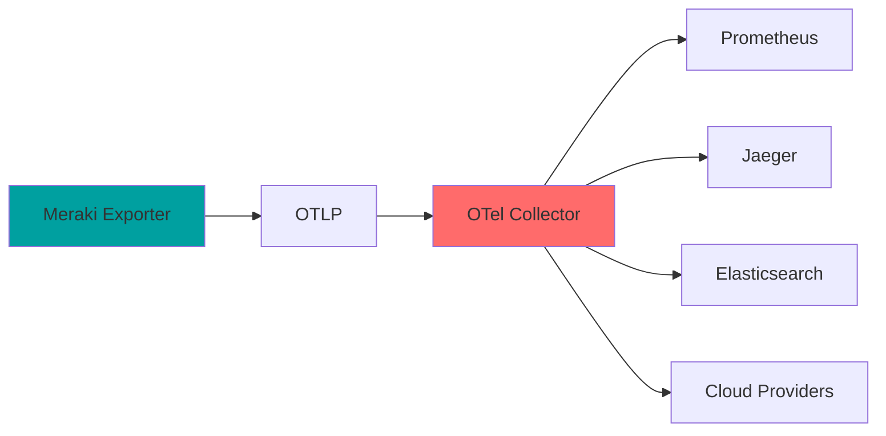

# OpenTelemetry Integration

The Meraki Dashboard Exporter includes built-in OpenTelemetry support for exporting metrics and structured logs to OTLP-compatible backends.

## Overview

OpenTelemetry integration provides:

- **Metrics Export**: Send metrics to OTLP collectors
- **Structured Logging**: JSON logs with trace correlation
- **Distributed Tracing**: Track API calls and performance
- **Multiple Backends**: Support for various observability platforms



## Configuration

### Basic Setup

Enable OpenTelemetry with environment variables:

```bash
# Enable OTLP export
MERAKI_EXPORTER_OTEL_ENABLED=true

# Set OTLP endpoint
MERAKI_EXPORTER_OTEL_ENDPOINT=http://otel-collector:4317

# Set service name
MERAKI_EXPORTER_OTEL_SERVICE_NAME=meraki-dashboard-exporter

# Optional: Headers for authentication
MERAKI_EXPORTER_OTEL_HEADERS=api-key=your-key,tenant=production

# Optional: Use insecure connection (for testing)
MERAKI_EXPORTER_OTEL_INSECURE=true
```

### Docker Compose Example

```yaml
services:
  meraki-exporter:
    image: ghcr.io/rknightion/meraki-dashboard-exporter:latest
    environment:
      - MERAKI_API_KEY=${MERAKI_API_KEY}
      - MERAKI_EXPORTER_OTEL_ENABLED=true
      - MERAKI_EXPORTER_OTEL_ENDPOINT=http://otel-collector:4317
      - MERAKI_EXPORTER_OTEL_SERVICE_NAME=meraki-prod
    depends_on:
      - otel-collector

  otel-collector:
    image: otel/opentelemetry-collector-contrib:latest
    command: ["--config=/etc/otel-collector-config.yaml"]
    volumes:
      - ./otel-collector-config.yaml:/etc/otel-collector-config.yaml
    ports:
      - "4317:4317"  # OTLP gRPC
      - "4318:4318"  # OTLP HTTP
      - "8888:8888"  # Prometheus metrics
```

## OpenTelemetry Collector Configuration

### Basic Collector Setup

Create `otel-collector-config.yaml`:

```yaml
receivers:
  otlp:
    protocols:
      grpc:
        endpoint: 0.0.0.0:4317
      http:
        endpoint: 0.0.0.0:4318

processors:
  batch:
    timeout: 10s
    send_batch_size: 1024

  resource:
    attributes:
      - key: environment
        value: production
        action: insert
      - key: team
        value: network-ops
        action: insert

  attributes:
    actions:
      - key: meraki.org_name
        action: promote  # Promote to resource level

exporters:
  prometheus:
    endpoint: 0.0.0.0:8888
    namespace: meraki
    const_labels:
      source: opentelemetry

  logging:
    loglevel: info

  otlp/tempo:
    endpoint: tempo:4317
    tls:
      insecure: true

service:
  pipelines:
    metrics:
      receivers: [otlp]
      processors: [batch, resource, attributes]
      exporters: [prometheus, logging]

    logs:
      receivers: [otlp]
      processors: [batch, resource]
      exporters: [logging]

    traces:
      receivers: [otlp]
      processors: [batch, resource]
      exporters: [otlp/tempo]
```

### Advanced Processing

```yaml
processors:
  # Filter metrics
  filter/metrics:
    metrics:
      include:
        match_type: regexp
        metric_names:
          - meraki_.*
      exclude:
        match_type: strict
        metric_names:
          - meraki_ms_port_traffic_bytes  # High cardinality

  # Transform metrics
  transform:
    metric_statements:
      - context: metric
        statements:
          - set(unit, "By") where name == "meraki_org_usage_total_kb"
          - scale_value(1000) where name == "meraki_org_usage_total_kb"

  # Tail sampling for traces
  tail_sampling:
    policies:
      - name: errors-policy
        type: status_code
        status_code: {status_codes: [ERROR]}
      - name: slow-requests
        type: latency
        latency: {threshold_ms: 1000}
```

## Structured Logging

### Log Format

The exporter outputs structured JSON logs compatible with OpenTelemetry:

```json
{
  "timestamp": "2024-01-15T10:30:45.123Z",
  "level": "INFO",
  "logger": "meraki_dashboard_exporter.collectors.organization",
  "message": "Successfully collected organization metrics",
  "trace_id": "7b3a4e0f8a3c4d5e6f7a8b9c0d1e2f3a",
  "span_id": "1a2b3c4d5e6f7890",
  "org_id": "123456",
  "org_name": "Acme Corp",
  "duration_ms": 245,
  "api_calls": 5
}
```

### Log Correlation

Correlate logs with metrics and traces:

```promql
# Find traces for slow collections
{service.name="meraki-dashboard-exporter"}
  | json
  | duration_ms > 1000
  | line_format "{{.trace_id}}"
```

## Metrics Export

### Metric Naming

OpenTelemetry metrics follow different conventions:

| Prometheus | OpenTelemetry |
|------------|---------------|
| `meraki_device_up` | `meraki.device.up` |
| `meraki_org_usage_total_kb` | `meraki.org.usage.total` (with unit: kb) |
| `meraki_mt_temperature_celsius` | `meraki.mt.temperature` (with unit: Cel) |

### Metric Metadata

OpenTelemetry includes rich metadata:

```json
{
  "name": "meraki.device.up",
  "description": "Device online status (1 = online, 0 = offline)",
  "unit": "1",
  "type": "gauge",
  "datapoints": [{
    "attributes": {
      "org_id": "123456",
      "org_name": "Acme Corp",
      "device_serial": "Q2XX-XXXX-XXXX",
      "device_model": "MR46"
    },
    "value": 1,
    "timestamp": 1705320000000000000
  }]
}
```

## Integration Examples

### Grafana Cloud

```yaml
exporters:
  otlphttp/grafana:
    endpoint: https://otlp-gateway-prod-us-central-0.grafana.net/otlp
    headers:
      Authorization: Basic ${env:GRAFANA_CLOUD_API_KEY}

service:
  pipelines:
    metrics:
      receivers: [otlp]
      processors: [batch]
      exporters: [otlphttp/grafana]
```

### AWS X-Ray and CloudWatch

```yaml
exporters:
  awsxray:
    region: us-east-1
    no_verify_ssl: false

  awsemf:
    region: us-east-1
    namespace: Meraki
    dimension_rollup_option: NoDimensionRollup

service:
  pipelines:
    traces:
      receivers: [otlp]
      processors: [batch]
      exporters: [awsxray]
    metrics:
      receivers: [otlp]
      processors: [batch]
      exporters: [awsemf]
```

### Datadog

```yaml
exporters:
  datadog:
    api:
      site: datadoghq.com
      key: ${env:DD_API_KEY}
    metrics:
      resource_attributes_as_tags: true
      instrumentation_scope_metadata_as_tags: true

service:
  pipelines:
    metrics:
      receivers: [otlp]
      processors: [batch]
      exporters: [datadog]
```

### Elastic APM

```yaml
exporters:
  otlp/elastic:
    endpoint: https://your-deployment.apm.region.cloud.es.io:443
    headers:
      Authorization: Bearer ${env:ELASTIC_APM_SECRET_TOKEN}

service:
  pipelines:
    metrics:
      receivers: [otlp]
      processors: [batch]
      exporters: [otlp/elastic]
    logs:
      receivers: [otlp]
      processors: [batch]
      exporters: [otlp/elastic]
```

## Distributed Tracing

### Trace Context

The exporter adds trace context to API calls:

```python
# Example trace structure
Trace: Collect Organization Metrics
├─ Span: Get Organizations
├─ Span: Collect Org 123456
│  ├─ Span: Get Licenses
│  ├─ Span: Get Networks
│  ├─ Span: Get Devices
│  └─ Span: Get Client Overview
└─ Span: Export Metrics
```

### Trace Sampling

Configure sampling in the collector:

```yaml
processors:
  probabilistic_sampler:
    sampling_percentage: 10  # Sample 10% of traces

  tail_sampling:
    policies:
      - name: sample-errors
        type: status_code
        status_code: {status_codes: [ERROR]}
        sampling_percentage: 100  # Sample all errors

      - name: sample-slow
        type: latency
        latency: {threshold_ms: 1000}
        sampling_percentage: 100  # Sample all slow requests
```

## Monitoring OpenTelemetry

### Collector Metrics

Monitor the collector itself:

```promql
# Data received
rate(otelcol_receiver_accepted_metric_points[5m])

# Data exported
rate(otelcol_exporter_sent_metric_points[5m])

# Queue size
otelcol_exporter_queue_size

# Errors
rate(otelcol_exporter_send_failed_metric_points[5m])
```

### Health Checks

```yaml
extensions:
  health_check:
    endpoint: 0.0.0.0:13133
    path: "/health"

  pprof:
    endpoint: 0.0.0.0:1777

service:
  extensions: [health_check, pprof]
```

## Best Practices

### 1. Resource Attributes

Set meaningful resource attributes:

```yaml
processors:
  resource:
    attributes:
      - key: deployment.environment
        value: production
        action: insert
      - key: service.version
        from_attribute: EXPORTER_VERSION
        action: insert
      - key: cloud.region
        value: us-east-1
        action: insert
```

### 2. Batching

Configure appropriate batch sizes:

```yaml
processors:
  batch:
    timeout: 10s
    send_batch_size: 1024
    send_batch_max_size: 2048
```

### 3. Error Handling

Implement retry and error handling:

```yaml
exporters:
  otlp:
    endpoint: otel-collector:4317
    retry_on_failure:
      enabled: true
      initial_interval: 5s
      max_interval: 30s
      max_elapsed_time: 300s
```

### 4. Security

Secure your OTLP endpoints:

```yaml
receivers:
  otlp:
    protocols:
      grpc:
        endpoint: 0.0.0.0:4317
        tls:
          cert_file: /certs/cert.pem
          key_file: /certs/key.pem
```

## Troubleshooting

### Debug Logging

Enable debug logging in the collector:

```yaml
service:
  telemetry:
    logs:
      level: debug
      development: true
      encoding: json
```

### Common Issues

1. **Connection Refused**:
   ```bash
   # Check collector is running
   curl http://otel-collector:13133/health

   # Verify endpoint configuration
   echo $MERAKI_EXPORTER_OTEL_ENDPOINT
   ```

2. **Authentication Errors**:
   ```yaml
   # Check headers format
   MERAKI_EXPORTER_OTEL_HEADERS="api-key=xxx,tenant=yyy"
   ```

3. **Missing Metrics**:
   ```yaml
   # Add debug exporter
   exporters:
     logging:
       loglevel: debug
   ```

4. **High Memory Usage**:
   ```yaml
   # Add memory limiter
   processors:
     memory_limiter:
       check_interval: 1s
       limit_mib: 512
       spike_limit_mib: 128
   ```

## Migration from Prometheus

### Dual Export

Export to both Prometheus and OTLP:

1. Keep Prometheus endpoint active
2. Enable OTLP export
3. Verify metrics in both systems
4. Gradually migrate dashboards
5. Disable Prometheus endpoint

### Query Translation

| Prometheus | OTLP Backend |
|------------|--------------|
| `meraki_device_up{org_name="Acme"}` | `meraki.device.up{org_name="Acme"}` |
| `rate(metric[5m])` | Platform-specific rate function |
| `histogram_quantile()` | Platform-specific percentile function |
