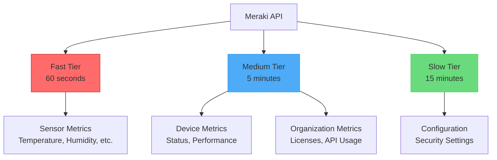

# Metrics Overview

The Meraki Dashboard Exporter provides comprehensive metrics across all aspects of your Meraki infrastructure. This guide explains the metric collection system and available metrics.

## Collection Tiers

The exporter uses a three-tier system to optimize API usage and provide timely data:



### Fast Tier (60 seconds)
- **Purpose**: Real-time environmental monitoring
- **Metrics**: MT sensor readings (temperature, humidity, door status, etc.)
- **Use Case**: Critical environmental alerts, real-time dashboards

### Medium Tier (5 minutes)
- **Purpose**: Standard operational metrics
- **Metrics**: Device status, network health, client counts, traffic statistics
- **Aligned**: With Meraki's 5-minute data aggregation windows

### Slow Tier (15 minutes)
- **Purpose**: Configuration and slowly changing data
- **Metrics**: Security settings, configuration changes
- **Use Case**: Compliance monitoring, configuration drift detection

## Metric Naming Convention

All metrics follow Prometheus best practices:

```
meraki_<category>_<metric>_<unit>
```

Examples:
- `meraki_org_devices_total` - Total count
- `meraki_mt_temperature_celsius` - Temperature in Celsius
- `meraki_ms_port_traffic_bytes` - Traffic in bytes

## Metric Types

### Gauges
Most metrics are gauges representing current values:
- Device status (0/1)
- Temperature readings
- Client counts
- License counts

### Counters
Some metrics are counters that only increase:
- Total API calls
- Error counts
- Traffic bytes (when collected cumulatively)

### Info Metrics
Informational metrics with labels:
- `meraki_org_info` - Organization details
- `meraki_device_info` - Device information

## Common Labels

All metrics include relevant labels for filtering and grouping:

| Label | Description | Example |
|-------|-------------|---------|
| `org_id` | Organization ID | `123456` |
| `org_name` | Organization name | `Acme Corp` |
| `network_id` | Network ID | `N_123456` |
| `network_name` | Network name | `Main Office` |
| `device_serial` | Device serial number | `Q2XX-XXXX-XXXX` |
| `device_name` | Device name | `3rd Floor Switch` |
| `device_model` | Device model | `MS120-8LP` |

## Metric Categories

<div class="grid cards" markdown>

- :material-domain: **Organization Metrics**
  API usage, licenses, device counts, client statistics

- :material-router-network: **Device Metrics**
  Status, performance, uptime for all device types

- :material-alert: **Alert Metrics**
  Active alerts by severity, type, and category

- :material-thermometer: **Sensor Metrics**
  Environmental monitoring from MT sensors

- :material-security: **Configuration Metrics**
  Security settings and configuration tracking

</div>

## API Alignment

The exporter is designed to work efficiently with Meraki's API:

### Data Freshness
- **5-minute alignment**: Many Meraki APIs return data in 5-minute intervals
- **Last complete interval**: APIs return the last complete time period
- **Example**: At 11:04, the API returns data for 10:55-11:00

### Rate Limiting
- Respects Meraki API rate limits
- Configurable retry logic
- Exponential backoff for failures

### Pagination
- Handles paginated responses automatically
- Uses `total_pages='all'` where supported
- Efficient batch collection

## Performance Metrics

The exporter tracks its own performance:

```prometheus
# Collection duration
meraki_collector_duration_seconds{collector="organization"} 2.5

# API calls made
meraki_collector_api_calls_total{collector="device"} 145

# Collection errors
meraki_collector_errors_total{collector="sensor"} 0

# Last successful collection
meraki_collector_last_success_timestamp_seconds{collector="alerts"} 1705320000
```

## Best Practices

### 1. Use Appropriate Queries
```promql
# Good: Rate calculation over 5 minutes
rate(meraki_org_usage_total_kb[5m])

# Good: Alert on missing data
up{job="meraki"} == 0
```

### 2. Label Filtering
```promql
# Filter by organization
meraki_device_up{org_name="Production"}

# Filter by device type
meraki_device_up{device_model=~"MS.*"}
```

### 3. Aggregation
```promql
# Total devices by type
sum by (device_model) (meraki_device_up)

# Average temperature by location
avg by (network_name) (meraki_mt_temperature_celsius)
```

## Grafana Integration

Example queries for common dashboards:

### Device Status Overview
```promql
sum by (device_model) (meraki_device_up)
```

### Temperature Heatmap
```promql
meraki_mt_temperature_celsius{network_name="$network"}
```

### API Usage Rate
```promql
rate(meraki_org_api_requests_total[5m])
```

## Next Steps

- Explore the [Complete Metrics Reference](metrics.md) for detailed metric information
- Learn about [Integration & Dashboards](../integration-dashboards.md) for visualization setup
- Set up [Deployment & Operations](../deployment-operations.md) for production monitoring
- Configure alerts using the examples in [Integration & Dashboards](../integration-dashboards.md)
