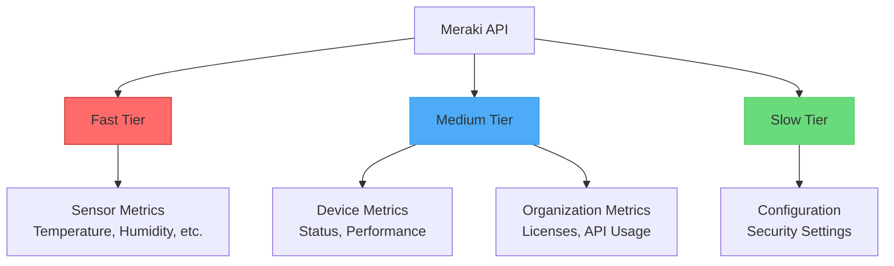

# Metrics Overview

The Meraki Dashboard Exporter provides comprehensive metrics across all aspects of your Meraki infrastructure. This guide explains the metric collection system and available metrics.

## Collection Tiers

The exporter uses a three-tier system to optimize API usage and provide timely data (intervals are configurable via `MERAKI_EXPORTER_UPDATE_INTERVALS__*` in the [Configuration](../config.md) reference):


```mermaid
graph TD
    A[Meraki API] --> B[Fast Tier]
    A --> C[Medium Tier]
    A --> D[Slow Tier]

    B --> E[Sensor Metrics<br/>Temperature, Humidity, etc.]
    C --> F[Device Metrics<br/>Status, Performance]
    C --> G[Organization Metrics<br/>Licenses, API Usage]
    D --> H[Configuration<br/>Security Settings]

    style B fill:#ff6b6b,stroke:#c92a2a
    style C fill:#4dabf7,stroke:#339af0
    style D fill:#69db7c,stroke:#51cf66
```

### Fast Tier
- **Purpose**: Real-time environmental monitoring
- **Metrics**: MT sensor readings (temperature, humidity, door status, etc.)
- **Use Case**: Critical environmental alerts, real-time dashboards

### Medium Tier
- **Purpose**: Standard operational metrics
- **Metrics**: Device status, network health, client counts, traffic statistics
- **Aligned**: With Meraki's 5-minute data aggregation windows

### Slow Tier
- **Purpose**: Configuration and slowly changing data
- **Metrics**: Security settings, configuration changes
- **Use Case**: Compliance monitoring, configuration drift detection

## Metric Naming Convention

All metrics follow Prometheus best practices:

```
meraki_<category>_<metric>_<unit>
```

Examples:
- `meraki_org_devices_total` - Total count
- `meraki_mt_temperature_celsius` - Temperature in Celsius
- `meraki_ms_port_traffic_bytes` - Traffic in bytes

## Metric Types

### Gauges
Most metrics are gauges representing current values:
- Device status (0/1)
- Temperature readings
- Client counts
- License counts

### Counters
Some metrics are counters that only increase:
- Total API calls
- Error counts
- Traffic bytes (when collected cumulatively)

### Info Metrics
Informational metrics with labels:
- `meraki_org_info` - Organization details (carries `org_name`, keyed by `org_id`)
- `meraki_network_info` - Network details (carries `network_name`, keyed by `network_id`)
- `meraki_device_status_info` - Device status/identity information (carries `name`, keyed by `serial`)

Mutable, human-readable **name** labels (`org_name`, `network_name`, device `name`, `port_name`,
`zone_name`, ...) are **not** present on numeric series — they live only on these id-keyed `*_info`
carriers. To display a name alongside a measurement, join the numeric series to its info metric on
the stable ID and pull the name across with `group_left`:

```promql
meraki_device_up
  * on (serial) group_left (name)
  meraki_device_status_info
```

See [Metric Stability & Deprecation Policy](../stability.md#name-labels-are-not-part-of-numeric-series)
for the rationale.

## Common Labels

All metrics include relevant labels for filtering and grouping:

| Label | Description | Example |
|-------|-------------|---------|
| `org_id` | Organization ID | `123456` |
| `org_name` | Organization name — **only on `meraki_org_info`**, not on numeric series (join on `org_id`) | `Acme Corp` |
| `network_id` | Network ID | `N_123456` |
| `network_name` | Network name — **only on `meraki_network_info`**, not on numeric series (join on `network_id`) | `Main Office` |
| `serial` | Device serial number | `Q2XX-XXXX-XXXX` |
| `name` | Device name — **only on `meraki_device_status_info`**, not on numeric series (join on `serial`) | `3rd Floor Switch` |
| `model` | Device model | `MS120-8LP` |
| `device_type` | Device type | `ms` |
| `collector` | Collector name (infrastructure metrics) | `DeviceCollector` |
| `tier` | Collection tier | `medium` |

## Metrics vs. OTel data logs: the cardinality boundary

Not every signal the exporter can collect belongs on `/metrics`. The dividing line:

- **Metrics** (this page, `/metrics`) carry bounded, fleet-shaped aggregates — label sets drawn
  from stable inventory (org / network / device serial / SSID number / port / band) or top-N sets
  bounded by construction.
- **OTel data logs** (opt-in, off by default) carry per-entity detail where the entity population
  is unbounded or churny — a client ID/MAC, a per-delivery-attempt row, any signal that fans out
  per-request rather than per-inventory-item.

No new client-keyed (or otherwise unbounded per-entity) labelled metric may be added. New
per-client/per-entity signals route to the OTel data-log emitter instead; see [OTel data logs
vs. metrics](../observability/otel.md#data-logs-vs-metrics-the-boundary-rule) for the full
doctrine, config, and record shape. The existing opt-in `meraki_client_*`/`meraki_clients_*`
numeric series (`collectors/clients.py`) are grandfathered under the ID-only +
`meraki_client_info` join contract (#533, see the [Stability
Policy](../stability.md#name-labels-are-not-part-of-numeric-series)) — they predate this doctrine
and are not migrated by it.

## Metric Categories

<div class="grid cards" markdown>

- :material-domain: **Organization Metrics**
  API usage, licenses, device counts, client statistics

- :material-router-network: **Device Metrics**
  Status, performance, uptime for all device types

- :material-alert: **Alert Metrics**
  Active alerts by severity, type, and category

- :material-thermometer: **Sensor Metrics**
  Environmental monitoring from MT sensors

- :material-security: **Configuration Metrics**
  Security settings and configuration tracking

- :material-tune-variant: **Platform Metrics**
  Collector health, API client metrics, cardinality, and webhooks

</div>

## API Alignment

The exporter is designed to work efficiently with Meraki's API:

### Data Freshness
- **5-minute alignment**: Many Meraki APIs return data in 5-minute intervals
- **Last complete interval**: APIs return the last complete time period
- **Example**: At 11:04, the API returns data for 10:55-11:00

### Rate Limiting
- Respects Meraki API rate limits
- Configurable retry logic
- Exponential backoff for failures

### Pagination
- Handles paginated responses automatically
- Uses `total_pages='all'` where supported
- Efficient batch collection

## Performance Metrics

The exporter tracks its own performance:

```prometheus
# Collection duration
meraki_exporter_collector_duration_seconds{collector="OrganizationCollector"} 2.5

# API calls made
meraki_exporter_collector_api_calls_total{collector="DeviceCollector"} 145

# Collection errors
meraki_exporter_collector_errors_total{collector="SensorCollector"} 0

# Timestamp of last successful collection
meraki_exporter_collector_success_timestamp_seconds{collector="AlertsCollector"} 1705320000
```

## Best Practices

### 1. Use Appropriate Queries
```promql
# Good: Rate calculation over 5 minutes
rate(meraki_org_usage_total_kb[5m])

# Good: Alert on missing data
up{job="meraki"} == 0
```

### 2. Label Filtering
```promql
# Filter by organization (numeric series are keyed by org_id; the org_name
# label lives on meraki_org_info). Filtering the right-hand side both
# restricts to that org and attaches the org_name label.
meraki_device_up
  * on (org_id) group_left (org_name)
  meraki_org_info{org_name="Production"}

# Filter by device type
meraki_device_up{model=~"MS.*"}
```

### 3. Aggregation
```promql
# Total devices by type
sum by (model) (meraki_device_up)

# Average temperature by location (group by the stable network_id, then
# attach network_name from meraki_network_info)
avg by (network_id) (meraki_mt_temperature_celsius)
  * on (network_id) group_left (network_name)
  meraki_network_info
```

## Grafana Integration

Example queries for common dashboards:

### Device Status Overview
```promql
sum by (model) (meraki_device_up)
```

### Temperature Heatmap
```promql
# Drive the $network variable off network_id; join to meraki_network_info to
# pull the display name across (or label the variable from meraki_network_info)
meraki_mt_temperature_celsius{network_id="$network"}
  * on (network_id) group_left (network_name)
  meraki_network_info
```

### API Usage Rate
```promql
rate(meraki_org_api_requests_total[5m])
```

## Next Steps

- Explore the [Complete Metrics Reference](metrics.md) for detailed metric information
- Learn about [Integration & Dashboards](../integration-dashboards.md) for visualization setup
- Set up [Deployment & Operations](../deployment-operations.md) for production monitoring
- Configure alerts using the examples in [Integration & Dashboards](../integration-dashboards.md)
