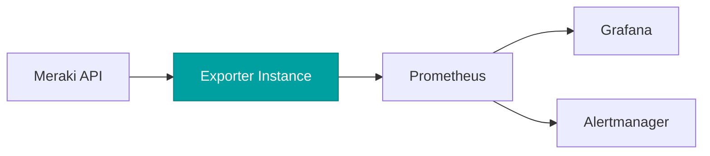
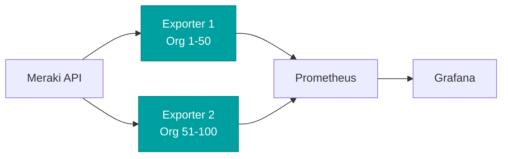

# Deployment Guide

This guide covers best practices and recommendations for deploying the Meraki Dashboard Exporter in production environments.

## Deployment Architecture

### Single Instance Deployment

For most organizations, a single exporter instance is sufficient:



### High Availability Deployment

For critical monitoring, deploy multiple instances with different org_ids:



## Container Deployment

### Docker Compose Production Setup

```yaml
version: '3.8'

services:
  meraki-exporter:
    image: ghcr.io/rknightion/meraki-dashboard-exporter:latest
    container_name: meraki-exporter
    restart: unless-stopped
    ports:
      - "127.0.0.1:9099:9099"  # Bind to localhost only
    environment:
      - MERAKI_API_KEY_FILE=/run/secrets/meraki_api_key
      - MERAKI_EXPORTER_LOG_LEVEL=INFO
      - MERAKI_EXPORTER_LOG_FORMAT=json
    secrets:
      - meraki_api_key
    healthcheck:
      test: ["CMD", "python", "-c", "import httpx; httpx.get('http://localhost:9099/health').raise_for_status()"]
      interval: 30s
      timeout: 10s
      retries: 3
      start_period: 40s
    security_opt:
      - no-new-privileges:true
    read_only: true
    user: "1000:1000"
    tmpfs:
      - /tmp
    deploy:
      resources:
        limits:
          memory: 512M
          cpus: '0.5'
        reservations:
          memory: 256M
          cpus: '0.25'

secrets:
  meraki_api_key:
    file: ./secrets/meraki_api_key.txt
```

### Kubernetes Deployment

Complete Kubernetes manifest with best practices:

```yaml
---
apiVersion: v1
kind: Namespace
metadata:
  name: monitoring
---
apiVersion: v1
kind: Secret
metadata:
  name: meraki-api-key
  namespace: monitoring
type: Opaque
stringData:
  api-key: "your-api-key-here"
---
apiVersion: v1
kind: ConfigMap
metadata:
  name: meraki-exporter-config
  namespace: monitoring
data:
  LOG_LEVEL: "INFO"
  LOG_FORMAT: "json"
  FAST_UPDATE_INTERVAL: "60"
  MEDIUM_UPDATE_INTERVAL: "300"
  SLOW_UPDATE_INTERVAL: "900"
---
apiVersion: apps/v1
kind: Deployment
metadata:
  name: meraki-exporter
  namespace: monitoring
  labels:
    app: meraki-exporter
spec:
  replicas: 1
  selector:
    matchLabels:
      app: meraki-exporter
  template:
    metadata:
      labels:
        app: meraki-exporter
      annotations:
        prometheus.io/scrape: "true"
        prometheus.io/port: "9099"
        prometheus.io/path: "/metrics"
    spec:
      serviceAccountName: meraki-exporter
      securityContext:
        runAsNonRoot: true
        runAsUser: 1000
        fsGroup: 1000
      containers:
      - name: meraki-exporter
        image: ghcr.io/rknightion/meraki-dashboard-exporter:latest
        imagePullPolicy: Always
        ports:
        - containerPort: 9099
          name: metrics
          protocol: TCP
        env:
        - name: MERAKI_API_KEY
          valueFrom:
            secretKeyRef:
              name: meraki-api-key
              key: api-key
        - name: MERAKI_EXPORTER_LOG_LEVEL
          valueFrom:
            configMapKeyRef:
              name: meraki-exporter-config
              key: LOG_LEVEL
        - name: MERAKI_EXPORTER_LOG_FORMAT
          valueFrom:
            configMapKeyRef:
              name: meraki-exporter-config
              key: LOG_FORMAT
        resources:
          requests:
            memory: "256Mi"
            cpu: "100m"
          limits:
            memory: "512Mi"
            cpu: "500m"
        livenessProbe:
          httpGet:
            path: /health
            port: metrics
          initialDelaySeconds: 30
          periodSeconds: 30
          timeoutSeconds: 10
          successThreshold: 1
          failureThreshold: 3
        readinessProbe:
          httpGet:
            path: /health
            port: metrics
          initialDelaySeconds: 10
          periodSeconds: 10
          timeoutSeconds: 5
          successThreshold: 1
          failureThreshold: 3
        securityContext:
          allowPrivilegeEscalation: false
          readOnlyRootFilesystem: true
          runAsNonRoot: true
          capabilities:
            drop:
            - ALL
---
apiVersion: v1
kind: Service
metadata:
  name: meraki-exporter
  namespace: monitoring
  labels:
    app: meraki-exporter
spec:
  type: ClusterIP
  ports:
  - port: 9099
    targetPort: metrics
    protocol: TCP
    name: metrics
  selector:
    app: meraki-exporter
---
apiVersion: v1
kind: ServiceAccount
metadata:
  name: meraki-exporter
  namespace: monitoring
---
apiVersion: policy/v1
kind: PodDisruptionBudget
metadata:
  name: meraki-exporter
  namespace: monitoring
spec:
  minAvailable: 1
  selector:
    matchLabels:
      app: meraki-exporter
```

## Resource Requirements

### Memory Usage

Expected memory usage by organization size:

| Organizations | Networks | Devices | Memory Usage |
|---------------|----------|---------|--------------|
| 1 | 10 | 100 | ~150 MB |
| 5 | 50 | 500 | ~250 MB |
| 10 | 100 | 1000 | ~400 MB |
| 50 | 500 | 5000 | ~800 MB |

### CPU Usage

- **Startup**: Brief spike to ~0.5 CPU
- **Steady State**: 0.05-0.2 CPU depending on scale
- **Collection Peaks**: Up to 0.5 CPU during bulk collection

### Network Requirements

- **Bandwidth**: Minimal (API calls only)
- **Latency**: Works well with up to 200ms to Meraki API
- **Connectivity**: Requires HTTPS access to Meraki API endpoints

## Security Considerations

### API Key Management

1. **Never hardcode API keys**
2. **Use secrets management**:
   - Kubernetes Secrets
   - Docker Secrets
   - AWS Secrets Manager
   - HashiCorp Vault
   - Azure Key Vault

3. **Rotate keys regularly**
4. **Use read-only API keys**

### Network Security

```yaml
# Example NetworkPolicy for Kubernetes
apiVersion: networking.k8s.io/v1
kind: NetworkPolicy
metadata:
  name: meraki-exporter
  namespace: monitoring
spec:
  podSelector:
    matchLabels:
      app: meraki-exporter
  policyTypes:
  - Ingress
  - Egress
  ingress:
  - from:
    - podSelector:
        matchLabels:
          app: prometheus
    ports:
    - protocol: TCP
      port: 9099
  egress:
  - to:
    - namespaceSelector: {}
    ports:
    - protocol: TCP
      port: 53  # DNS
  - to:
    - namespaceSelector: {}
    ports:
    - protocol: TCP
      port: 443  # HTTPS for Meraki API
```

### Container Security

1. **Run as non-root user**
2. **Read-only root filesystem**
3. **Drop all capabilities**
4. **Use security policies**:
   ```yaml
   # Pod Security Policy example
   apiVersion: policy/v1beta1
   kind: PodSecurityPolicy
   metadata:
     name: meraki-exporter
   spec:
     privileged: false
     allowPrivilegeEscalation: false
     requiredDropCapabilities:
     - ALL
     volumes:
     - 'configMap'
     - 'emptyDir'
     - 'projected'
     - 'secret'
     runAsUser:
       rule: 'MustRunAsNonRoot'
     seLinux:
       rule: 'RunAsAny'
     fsGroup:
       rule: 'RunAsAny'
   ```

## Monitoring the Exporter

### Prometheus Scrape Configuration

```yaml
scrape_configs:
  - job_name: 'meraki-exporter'
    static_configs:
      - targets: ['meraki-exporter:9099']
    scrape_interval: 30s
    scrape_timeout: 25s
    metric_relabel_configs:
      # Drop high-cardinality metrics if needed
      - source_labels: [__name__]
        regex: 'meraki_ms_port_.*'
        action: drop  # Example: drop port metrics
```

### Health Monitoring

Create alerts for exporter health:

```yaml
groups:
  - name: meraki_exporter_health
    rules:
      - alert: MerakiExporterDown
        expr: up{job="meraki-exporter"} == 0
        for: 5m
        labels:
          severity: critical
        annotations:
          summary: "Meraki Exporter is down"

      - alert: MerakiExporterHighMemory
        expr: container_memory_usage_bytes{pod=~"meraki-exporter.*"} > 500000000
        for: 15m
        labels:
          severity: warning
        annotations:
          summary: "Meraki Exporter high memory usage"

      - alert: MerakiExporterAPIErrors
        expr: rate(meraki_collector_errors_total[5m]) > 0.1
        for: 15m
        labels:
          severity: warning
        annotations:
          summary: "Meraki Exporter API errors"
```

## Performance Tuning

### API Rate Limit Management

1. **Monitor API usage**:
   ```promql
   rate(meraki_collector_api_calls_total[5m])
   ```

2. **Adjust intervals if hitting limits**:
   ```yaml
   MERAKI_EXPORTER_FAST_UPDATE_INTERVAL: "120"
   MERAKI_EXPORTER_MEDIUM_UPDATE_INTERVAL: "600"
   ```

3. **Distribute load across multiple instances**

### Metric Optimization

1. **Disable unnecessary collectors**:
   ```yaml
   # Future feature: selective collection
   MERAKI_EXPORTER_COLLECTORS: "organization,device,alerts"
   ```

2. **Use Prometheus relabeling** to drop high-cardinality metrics

3. **Implement recording rules** for expensive queries

## Backup and Recovery

### Configuration Backup

1. **Version control** your deployment manifests
2. **Document** your configuration decisions
3. **Test** recovery procedures regularly

### Metric Continuity

1. **Use remote storage** for Prometheus (Thanos, Cortex, etc.)
2. **Configure retention** appropriately
3. **Plan for exporter downtime** (Prometheus will handle gaps)

## Maintenance

### Updates

1. **Monitor releases** on GitHub
2. **Test updates** in staging first
3. **Use specific image tags** in production:
   ```yaml
   image: ghcr.io/rknightion/meraki-dashboard-exporter:v1.2.3
   ```

### Log Management

Configure log aggregation:
```yaml
# Fluentd example
<source>
  @type tail
  path /var/log/containers/*meraki-exporter*.log
  tag meraki.exporter
  <parse>
    @type json
  </parse>
</source>
```

## Troubleshooting Deployment Issues

See the [Troubleshooting Guide](troubleshooting.md) for common issues and solutions.
