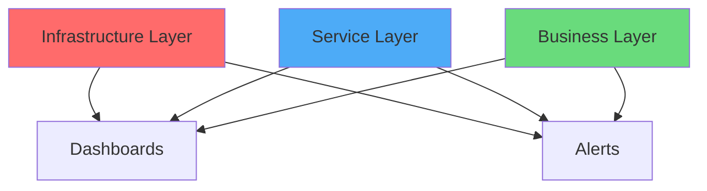

# Monitoring Guide

This guide covers how to effectively monitor your Meraki infrastructure using the exporter, including dashboard setup, alerting strategies, and performance monitoring.

## Monitoring Strategy

### Three-Layer Monitoring Approach



1. **Infrastructure Layer**: Device health, connectivity
2. **Service Layer**: Performance, capacity, errors
3. **Business Layer**: User experience, SLA compliance

## Key Metrics to Monitor

### Device Health

Essential metrics for infrastructure monitoring:

```promql
# Device availability by type
avg by (device_model) (meraki_device_up) * 100

# Devices offline for >15 minutes
meraki_device_up == 0

# Switch port utilization
rate(meraki_ms_port_traffic_bytes[5m]) * 8 / 1e9
```

### Network Performance

```promql
# Wireless client density
meraki_mr_clients_connected / count by (network_name) (meraki_device_up{device_model=~"MR.*"})

# Channel utilization trends
avg by (network_name) (meraki_ap_channel_utilization_5ghz_percent)

# Connection success rate
meraki_network_wireless_connection_success_percent{connection_step="success"}
```

### Environmental Monitoring

```promql
# Temperature anomalies
abs(meraki_mt_temperature_celsius - avg by (network_name) (meraki_mt_temperature_celsius)) > 5

# Humidity out of range
meraki_mt_humidity_percent < 30 or meraki_mt_humidity_percent > 70

# Door open duration
meraki_mt_door_status * (time() - meraki_mt_door_status offset 5m)
```

## Dashboard Design

### Executive Dashboard

Key metrics for leadership visibility:

1. **Organization Overview**
   - Total devices and their status
   - License utilization and expiration
   - Active alerts by severity
   - Network availability percentage

2. **Performance Indicators**
   - Client satisfaction (connection success rate)
   - Bandwidth utilization trends
   - API usage vs limits

3. **Business Impact**
   - Sites with issues
   - User experience scores
   - Configuration change frequency

### Operations Dashboard

Detailed view for network operations:

```json
{
  "dashboard": {
    "title": "Meraki Operations Dashboard",
    "panels": [
      {
        "title": "Device Status Matrix",
        "gridPos": {"h": 8, "w": 12, "x": 0, "y": 0},
        "targets": [{
          "expr": "meraki_device_up",
          "format": "table"
        }]
      },
      {
        "title": "Active Alerts",
        "gridPos": {"h": 8, "w": 12, "x": 12, "y": 0},
        "targets": [{
          "expr": "sum by (severity, type) (meraki_alerts_active)"
        }]
      },
      {
        "title": "Network Health Score",
        "gridPos": {"h": 8, "w": 24, "x": 0, "y": 8},
        "targets": [{
          "expr": "avg by (network_name) (meraki_network_wireless_connection_success_percent{connection_step=\"success\"})"
        }]
      }
    ]
  }
}
```

### Capacity Planning Dashboard

Monitor resource utilization:

- Port usage percentage
- Wireless client capacity
- License consumption trends
- PoE power budget utilization

## Alerting Strategy

### Alert Severity Levels

| Severity | Response Time | Examples | Action |
|----------|--------------|----------|---------|
| **Critical** | < 15 min | Site down, multiple devices offline | Page on-call |
| **High** | < 1 hour | Device down, high error rate | Create ticket |
| **Medium** | < 4 hours | Performance degradation | Email team |
| **Low** | Next day | Capacity warnings | Dashboard only |

### Alert Design Principles

1. **Actionable**: Every alert should have a clear action
2. **Contextual**: Include relevant information in annotations
3. **Deduplicated**: Group related alerts together
4. **Tested**: Regularly verify alerts work as expected

### Example Alert Configurations

#### Site Down Detection
```yaml
groups:
  - name: site_availability
    rules:
      - alert: SiteDown
        expr: |
          count by (network_name) (meraki_device_up{network_name!=""} == 0)
          / count by (network_name) (meraki_device_up{network_name!=""}) > 0.5
        for: 5m
        labels:
          severity: critical
          team: network-ops
        annotations:
          summary: "Site {{ $labels.network_name }} is down"
          description: "More than 50% of devices at {{ $labels.network_name }} are offline"
          runbook_url: "https://wiki.company.com/runbooks/site-down"
```

#### Performance Degradation
```yaml
- alert: WirelessPerformanceDegraded
  expr: |
    meraki_network_wireless_connection_success_percent{connection_step="success"} < 80
  for: 15m
  labels:
    severity: high
  annotations:
    summary: "Wireless performance degraded at {{ $labels.network_name }}"
    description: "Success rate is {{ $value }}% (threshold: 80%)"
```

#### Capacity Warnings
```yaml
- alert: HighClientDensity
  expr: |
    meraki_mr_clients_connected > 50
  for: 30m
  labels:
    severity: medium
  annotations:
    summary: "High client density on {{ $labels.device_name }}"
    description: "{{ $value }} clients connected (threshold: 50)"
```

## SLA Monitoring

### Availability Calculation

```promql
# Network availability (percentage)
(1 - (
  sum_over_time(
    (count by (network_name) (meraki_device_up == 0) > 0)[30d:5m]
  ) /
  count_over_time(
    (count by (network_name) (meraki_device_up))[30d:5m]
  )
)) * 100
```

### Performance SLA

```promql
# Connection success SLA (>95%)
avg_over_time(
  meraki_network_wireless_connection_success_percent{
    connection_step="success"
  }[30d]
) > 95
```

## Trend Analysis

### Capacity Trends

```promql
# Client growth rate (week over week)
(
  avg_over_time(meraki_org_clients_total[1w])
  - avg_over_time(meraki_org_clients_total[1w] offset 1w)
) / avg_over_time(meraki_org_clients_total[1w] offset 1w) * 100

# Bandwidth growth trend
predict_linear(meraki_org_usage_total_kb[30d], 86400 * 30)
```

### Problem Patterns

```promql
# Recurring issues (same time daily)
avg by (hour()) (
  increase(meraki_alerts_active[1h])
)

# Correlation analysis
meraki_alerts_active and on(network_id)
  (rate(meraki_org_configuration_changes_total[1h]) > 0)
```

## Performance Monitoring

### Exporter Performance

Monitor the exporter itself:

```promql
# Collection duration by tier
histogram_quantile(0.95,
  rate(meraki_collector_duration_seconds_bucket[5m])
)

# API call rate
sum(rate(meraki_collector_api_calls_total[5m]))

# Error rate
rate(meraki_collector_errors_total[5m])
```

### Optimization Opportunities

1. **High cardinality metrics**:
   ```promql
   count by (__name__)({__name__=~"meraki_.*"})
   ```

2. **Slow queries**:
   ```promql
   topk(10, prometheus_engine_query_duration_seconds)
   ```

## Reporting

### Daily Operations Report

Key metrics to include:
- Device availability percentage
- Active alerts summary
- Configuration changes
- Top issues by frequency

### Monthly Executive Report

Business-focused metrics:
- Overall network availability
- User experience trends
- Capacity utilization
- License status

### Automated Reports

Using Grafana reporting:
```bash
# Example: Generate PDF report
curl -X POST http://grafana:3000/api/reports/email \
  -H "Authorization: Bearer $GRAFANA_API_KEY" \
  -d '{
    "dashboardId": 1,
    "name": "Monthly Meraki Report",
    "recipients": "network-team@company.com"
  }'
```

## Integration with Other Tools

### PagerDuty Integration

```yaml
# Alertmanager configuration
receivers:
  - name: 'pagerduty-critical'
    pagerduty_configs:
      - routing_key: 'YOUR_ROUTING_KEY'
        description: '{{ .GroupLabels.alertname }}'
        details:
          network: '{{ .GroupLabels.network_name }}'
          severity: '{{ .GroupLabels.severity }}'
```

### Slack Notifications

```yaml
- name: 'slack-warnings'
  slack_configs:
    - api_url: 'YOUR_WEBHOOK_URL'
      title: 'Meraki Alert'
      text: '{{ range .Alerts }}{{ .Annotations.summary }}{{ end }}'
```

### ServiceNow Integration

Create incidents automatically:
```python
# Example webhook receiver
def create_incident(alert_data):
    incident = {
        "short_description": alert_data["annotations"]["summary"],
        "description": alert_data["annotations"]["description"],
        "category": "Network",
        "impact": map_severity(alert_data["labels"]["severity"])
    }
    servicenow_api.create_incident(incident)
```

## Best Practices

1. **Start Simple**: Begin with basic availability monitoring
2. **Iterate**: Add complexity based on actual needs
3. **Document**: Keep runbooks updated with alert responses
4. **Review**: Regularly review and tune alerts
5. **Automate**: Automate common remediation tasks
