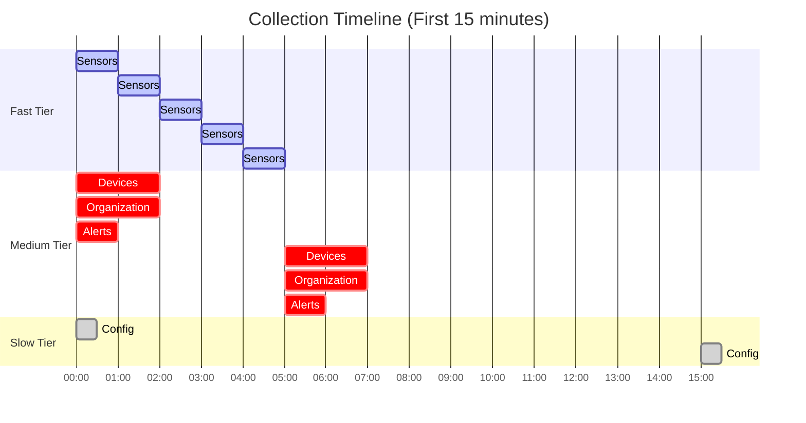

# Performance Tuning Guide

This guide provides recommendations for optimizing the Meraki Dashboard Exporter for different scales and use cases.

## Performance Characteristics

### Resource Usage by Scale

| Scale | Organizations | Networks | Devices | Memory | CPU | API Calls/Hour |
|-------|--------------|----------|---------|---------|-----|----------------|
| Small | 1 | 10 | 100 | 150MB | 0.1 | ~500 |
| Medium | 5 | 50 | 500 | 300MB | 0.2 | ~2,500 |
| Large | 10 | 100 | 1,000 | 500MB | 0.3 | ~5,000 |
| X-Large | 50 | 500 | 5,000 | 1GB | 0.5 | ~25,000 |

### Collection Timing

Understanding collection cycles:



## Optimization Strategies

### 1. API Rate Limit Management

#### Understanding Meraki Rate Limits

- **Default**: 10 requests/second per organization
- **Burst**: Up to 30 requests in short bursts
- **Daily**: Soft limit around 200,000 requests/day

#### Optimizing API Usage

```python
# Current API calls per collection cycle
Fast Tier (60s):
  - Sensor readings: 1 call per org

Medium Tier (300s):
  - Organization: ~10 calls per org
  - Devices: ~5 calls per org
  - Alerts: 1 call per org

Slow Tier (900s):
  - Config: 2 calls per org
```

#### Rate Limit Monitoring

```promql
# Current API call rate
rate(meraki_collector_api_calls_total[5m])

# Estimate daily usage
rate(meraki_collector_api_calls_total[1h]) * 24

# Alert on high usage
alert: HighAPIUsage
expr: rate(meraki_collector_api_calls_total[5m]) > 8
```

### 2. Memory Optimization

#### Reduce Metric Cardinality

High cardinality sources and solutions:

1. **Switch Port Metrics**
   ```yaml
   # Problem: 48 ports × 100 switches = 4,800 series

   # Solution 1: Drop in Prometheus
   metric_relabel_configs:
     - source_labels: [__name__, port_id]
       regex: 'meraki_ms_port.*;(4[0-9]|[5-9][0-9])'  # Drop ports 40+
       action: drop

   # Solution 2: Aggregate at collection (future feature)
   MERAKI_EXPORTER_PORT_AGGREGATION: true
   ```

2. **Device Labels**
   ```yaml
   # Reduce labels on high-cardinality metrics
   metric_relabel_configs:
     - regex: 'device_serial|device_mac|firmware'
       action: labeldrop
   ```

#### Memory Usage Patterns

```promql
# Monitor memory growth
deriv(container_memory_usage_bytes{pod=~"meraki-exporter.*"}[1h])

# Set appropriate limits
resources:
  requests:
    memory: "256Mi"
  limits:
    memory: "512Mi"  # 2x request
```

### 3. Collection Interval Tuning

#### Choosing Optimal Intervals

Consider these factors:

1. **Data Freshness Requirements**
2. **API Rate Limits**
3. **Prometheus Retention**
4. **Alert Sensitivity**

#### Recommended Configurations

**Real-time Monitoring** (Higher API usage):
```yaml
MERAKI_EXPORTER_FAST_UPDATE_INTERVAL: 30
MERAKI_EXPORTER_MEDIUM_UPDATE_INTERVAL: 300
MERAKI_EXPORTER_SLOW_UPDATE_INTERVAL: 900
```

**Standard Monitoring** (Balanced):
```yaml
MERAKI_EXPORTER_FAST_UPDATE_INTERVAL: 60
MERAKI_EXPORTER_MEDIUM_UPDATE_INTERVAL: 300
MERAKI_EXPORTER_SLOW_UPDATE_INTERVAL: 900
```

**Conservative Monitoring** (Lower API usage):
```yaml
MERAKI_EXPORTER_FAST_UPDATE_INTERVAL: 120
MERAKI_EXPORTER_MEDIUM_UPDATE_INTERVAL: 600
MERAKI_EXPORTER_SLOW_UPDATE_INTERVAL: 1800
```

### 4. Horizontal Scaling

#### Multi-Instance Deployment

For large deployments, split organizations across instances:

```yaml
# Instance 1
services:
  meraki-exporter-1:
    environment:
      - MERAKI_EXPORTER_ORG_ID=123456,123457,123458
    deploy:
      replicas: 1

# Instance 2
services:
  meraki-exporter-2:
    environment:
      - MERAKI_EXPORTER_ORG_ID=123459,123460,123461
    deploy:
      replicas: 1
```

#### Load Distribution

```promql
# Monitor load distribution
sum by (instance) (meraki_collector_api_calls_total)

# Check balance
stddev(sum by (instance) (rate(meraki_collector_api_calls_total[5m])))
```

### 5. Prometheus Optimization

#### Efficient Scraping

```yaml
scrape_configs:
  - job_name: 'meraki'
    static_configs:
      - targets: ['meraki-exporter:9099']
    scrape_interval: 30s
    scrape_timeout: 25s
    # Limit sample count
    sample_limit: 10000
    # Limit label count
    label_limit: 30
    label_name_length_limit: 200
    label_value_length_limit: 200
```

#### Recording Rules

Pre-compute expensive queries:

```yaml
groups:
  - name: meraki_recordings
    interval: 60s
    rules:
      # Device availability by type
      - record: meraki:device_availability:5m
        expr: |
          avg by (device_model) (meraki_device_up)

      # Network health score
      - record: meraki:network_health:5m
        expr: |
          avg by (network_name) (
            meraki_network_wireless_connection_success_percent{
              connection_step="success"
            }
          )

      # Total bandwidth by org
      - record: meraki:bandwidth_mbps:5m
        expr: |
          sum by (org_name) (
            rate(meraki_org_usage_total_kb[5m]) * 8 / 1000
          )
```

### 6. Network Optimization

#### Regional Endpoints

Use the closest API endpoint:

```yaml
# Reduce latency by using regional endpoints
MERAKI_EXPORTER_API_BASE_URL: "https://api.meraki.com/api/v1"  # US
# or
MERAKI_EXPORTER_API_BASE_URL: "https://api.meraki.ca/api/v1"   # Canada
# or
MERAKI_EXPORTER_API_BASE_URL: "https://api.meraki.cn/api/v1"   # China
```

#### Connection Pooling

The exporter uses connection pooling by default:
- Persistent HTTPS connections
- Automatic retry with exponential backoff
- Concurrent API calls where possible

### 7. Docker Optimization

#### Image Size

Use multi-stage builds (already implemented):
```dockerfile
# Minimal runtime image
FROM python:3.11-slim
# Only necessary runtime dependencies
```

#### Container Limits

```yaml
deploy:
  resources:
    limits:
      cpus: '0.5'
      memory: 512M
    reservations:
      cpus: '0.25'
      memory: 256M
```

## Monitoring Performance

### Key Performance Indicators

```promql
# Collection efficiency
histogram_quantile(0.95,
  rate(meraki_collector_duration_seconds_bucket[5m])
) by (collector)

# API efficiency
rate(meraki_collector_api_calls_total[5m])
/
rate(meraki_collector_duration_seconds_sum[5m])

# Error rate
rate(meraki_collector_errors_total[5m])
/
rate(meraki_collector_api_calls_total[5m])
```

### Performance Dashboard

Create a dedicated performance dashboard:

```json
{
  "dashboard": {
    "title": "Meraki Exporter Performance",
    "panels": [
      {
        "title": "Collection Duration by Tier",
        "targets": [{
          "expr": "histogram_quantile(0.95, rate(meraki_collector_duration_seconds_bucket[5m]))"
        }]
      },
      {
        "title": "API Calls per Second",
        "targets": [{
          "expr": "rate(meraki_collector_api_calls_total[5m])"
        }]
      },
      {
        "title": "Memory Usage",
        "targets": [{
          "expr": "container_memory_usage_bytes{pod=~\"meraki-exporter.*\"}"
        }]
      },
      {
        "title": "Metric Count",
        "targets": [{
          "expr": "prometheus_tsdb_symbol_table_size_bytes{job=\"prometheus\"}"
        }]
      }
    ]
  }
}
```

## Troubleshooting Performance Issues

### High Memory Usage

1. **Check metric cardinality**:
   ```promql
   count by (__name__)({job="meraki"})
   ```

2. **Identify high-cardinality metrics**:
   ```promql
   topk(10, count by (__name__)({job="meraki"}))
   ```

3. **Drop unnecessary metrics**:
   ```yaml
   metric_relabel_configs:
     - source_labels: [__name__]
       regex: 'meraki_ms_port_.*'
       action: drop
   ```

### Slow Collections

1. **Check collection duration**:
   ```promql
   meraki_collector_duration_seconds{quantile="0.95"}
   ```

2. **Identify slow endpoints**:
   - Enable DEBUG logging
   - Look for slow API calls
   - Consider increasing timeouts

3. **Optimize slow collectors**:
   - Reduce frequency
   - Limit scope
   - Use pagination efficiently

### API Rate Limiting

1. **Monitor 429 errors**:
   ```bash
   docker logs meraki-exporter | grep 429 | wc -l
   ```

2. **Calculate optimal intervals**:
   ```python
   # Organizations × API calls per cycle ÷ Rate limit = Minimum interval
   # Example: 10 orgs × 20 calls ÷ 10 req/s = 20 seconds minimum
   ```

3. **Implement backoff**:
   - Exporter implements automatic exponential backoff
   - Increase intervals if consistently hitting limits

## Best Practices

1. **Start Conservative**: Begin with longer intervals and decrease as needed
2. **Monitor Continuously**: Track performance metrics alongside business metrics
3. **Plan for Growth**: Design for 2x current scale
4. **Test Changes**: Always test performance changes in staging
5. **Document Settings**: Keep records of what works for your scale

## Capacity Planning

### Estimating Requirements

```python
# Formula for API calls per hour
api_calls_per_hour = (
    (orgs * 1 * 3600/fast_interval) +     # Sensor calls
    (orgs * 16 * 3600/medium_interval) +  # Medium tier calls
    (orgs * 2 * 3600/slow_interval)       # Slow tier calls
)

# Example: 10 orgs, default intervals
# = (10 * 1 * 60) + (10 * 16 * 12) + (10 * 2 * 4)
# = 600 + 1920 + 80 = 2,600 calls/hour
```

### Growth Planning

Monitor trends to plan capacity:
```promql
# Predict device growth (30 days)
predict_linear(count(meraki_device_up)[30d:1h], 86400 * 30)

# Predict memory usage
predict_linear(container_memory_usage_bytes[7d:1h], 86400 * 7)
```
